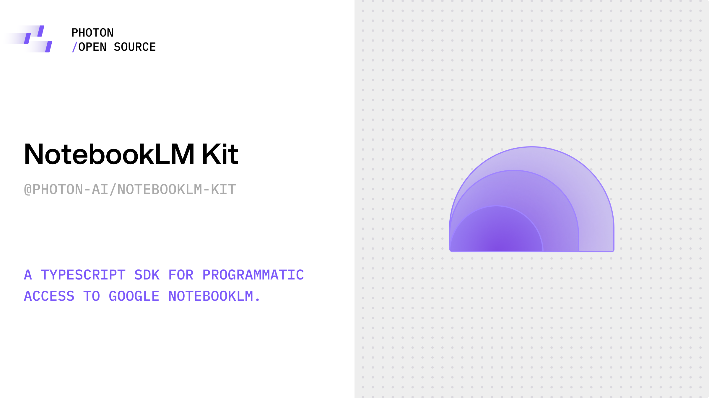

<div align="center">


   
# notebooklm-kit

> A TypeScript SDK for programmatic access to Google NotebookLM.

</div>

[](https://www.npmjs.com/package/notebooklm-kit)
[](https://www.typescriptlang.org/)
[](./LICENSE)
[](https://discord.gg/bZd4CMd2H5)

## Overview

The NotebookLM Kit provides a clean, service-based interface to all NotebookLM features. Perfect for building AI research assistants, study tools, content generators, and automated knowledge management systems.

## Features

<table>
<thead>
<tr>
<th>Feature</th>
<th>Method</th>
<th>Example</th>
</tr>
</thead>
<tbody>
<tr style="height: 30px;"><td colspan="3"></td></tr>
<tr>
<td colspan="3" style="padding-top: 20px; padding-bottom: 20px;"><strong style="font-size: 1.2em;"><a href="#notebooks">Notebook Management</a></strong> <small><code>list()</code>, <code>create()</code>, <code>get()</code>, <code>update()</code>, <code>delete()</code>, <code>share()</code></small></td>
</tr>
<tr style="height: 30px;"><td colspan="3"></td></tr>
<tr>
<td>List Notebooks</td>
<td><code>sdk.notebooks.list()</code></td>
<td><a href="examples/notebook-list.ts">notebook-list.ts</a></td>
</tr>
<tr>
<td>Create Notebook</td>
<td><code>sdk.notebooks.create()</code></td>
<td><a href="examples/notebook-create.ts">notebook-create.ts</a></td>
</tr>
<tr>
<td>Get Notebook</td>
<td><code>sdk.notebooks.get()</code></td>
<td><a href="examples/notebook-get.ts">notebook-get.ts</a></td>
</tr>
<tr>
<td>Update Notebook</td>
<td><code>sdk.notebooks.update()</code></td>
<td><a href="examples/notebook-update.ts">notebook-update.ts</a></td>
</tr>
<tr>
<td>Delete Notebook</td>
<td><code>sdk.notebooks.delete()</code></td>
<td><a href="examples/notebook-delete.ts">notebook-delete.ts</a></td>
</tr>
<tr>
<td>Share Notebook <small>⚠️ Experimental</small></td>
<td><code>sdk.notebooks.share()</code></td>
<td><a href="examples/notebook-share.ts">notebook-share.ts</a></td>
</tr>
<tr style="height: 30px;"><td colspan="3"></td></tr>
<tr>
<td colspan="3" style="padding-top: 20px; padding-bottom: 20px;"><strong style="font-size: 1.2em;"><a href="#sources">Source Management</a></strong> <small><code>list()</code>, <code>get()</code>, <code>add.url()</code>, <code>add.text()</code>, <code>add.youtube()</code>, <code>add.file()</code>, <code>add.drive()</code>, <code>add.batch()</code>, <code>add.web.searchAndWait()</code>, <code>update()</code>, <code>delete()</code>, <code>status()</code></small></td>
</tr>
<tr style="height: 30px;"><td colspan="3"></td></tr>
<tr>
<td>List Sources</td>
<td><code>sdk.sources.list()</code></td>
<td><a href="examples/source-list.ts">source-list.ts</a></td>
</tr>
<tr>
<td>Add URL Source</td>
<td><code>sdk.sources.add.url()</code></td>
<td><a href="examples/source-add-url.ts">source-add-url.ts</a></td>
</tr>
<tr>
<td>Add Text Source</td>
<td><code>sdk.sources.add.text()</code></td>
<td><a href="examples/source-add-text.ts">source-add-text.ts</a></td>
</tr>
<tr>
<td>Add YouTube Source</td>
<td><code>sdk.sources.add.youtube()</code></td>
<td><a href="examples/source-add-youtube.ts">source-add-youtube.ts</a></td>
</tr>
<tr>
<td>Add File Source</td>
<td><code>sdk.sources.add.file()</code></td>
<td><a href="examples/source-add-file.ts">source-add-file.ts</a></td>
</tr>
<tr>
<td>Add Drive Source <small>⚠️ Experimental</small></td>
<td><code>sdk.sources.add.drive()</code></td>
<td><a href="examples/source-add-drive.ts">source-add-drive.ts</a></td>
</tr>
<tr>
<td>Add Batch Sources</td>
<td><code>sdk.sources.add.batch()</code></td>
<td><a href="examples/source-add-batch.ts">source-add-batch.ts</a></td>
</tr>
<tr>
<td>Web Search Source</td>
<td><code>sdk.sources.add.web.searchAndWait()</code></td>
<td><a href="examples/source-web-search.ts">source-web-search.ts</a></td>
</tr>
<tr>
<td>Advanced Web Search</td>
<td><code>sdk.sources.add.web.searchAndWait()</code></td>
<td><a href="examples/source-web-search-advanced.ts">source-web-search-advanced.ts</a></td>
</tr>
<tr>
<td>Get Source</td>
<td><code>sdk.sources.get()</code></td>
<td><a href="examples/source-get.ts">source-get.ts</a></td>
</tr>
<tr>
<td>Update Source</td>
<td><code>sdk.sources.update()</code></td>
<td><a href="examples/source-update.ts">source-update.ts</a></td>
</tr>
<tr>
<td>Delete Source</td>
<td><code>sdk.sources.delete()</code></td>
<td><a href="examples/source-delete.ts">source-delete.ts</a></td>
</tr>
<tr>
<td>Check Source Status</td>
<td><code>sdk.sources.status()</code></td>
<td><a href="examples/source-status.ts">source-status.ts</a></td>
</tr>
<tr style="height: 30px;"><td colspan="3"></td></tr>
<tr>
<td colspan="3" style="padding-top: 20px; padding-bottom: 20px;"><strong style="font-size: 1.2em;"><a href="#artifacts">Artifact Generation</a></strong> <small><code>create()</code>, <code>list()</code>, <code>get()</code>, <code>download()</code>, <code>rename()</code>, <code>delete()</code>, <code>share()</code></small></td>
</tr>
<tr style="height: 30px;"><td colspan="3"></td></tr>
<tr>
<td>Create Artifact</td>
<td><code>sdk.artifacts.create()</code></td>
<td><a href="examples/artifact-create.ts">artifact-create.ts</a></td>
</tr>
<tr>
<td>Create Artifact (Subservices)</td>
<td><code>sdk.artifacts.{type}.create()</code></td>
<td><a href="examples/artifact-create-subservices.ts">artifact-create-subservices.ts</a></td>
</tr>
<tr>
<td>List Artifacts</td>
<td><code>sdk.artifacts.list()</code></td>
<td><a href="examples/artifact-list.ts">artifact-list.ts</a></td>
</tr>
<tr>
<td>Get Artifact</td>
<td><code>sdk.artifacts.get()</code></td>
<td><a href="examples/artifact-get.ts">artifact-get.ts</a></td>
</tr>
<tr>
<td>Download Artifact</td>
<td><code>sdk.artifacts.download()</code></td>
<td><a href="examples/artifact-download.ts">artifact-download.ts</a></td>
</tr>
<tr>
<td>Download Video</td>
<td><code>sdk.artifacts.download()</code></td>
<td><a href="examples/artifact-video.ts">artifact-video.ts</a></td>
</tr>
<tr>
<td>Download Slides</td>
<td><code>sdk.artifacts.download()</code></td>
<td><a href="examples/slide-download-test.ts">slide-download-test.ts</a></td>
</tr>
<tr>
<td>Rename Artifact</td>
<td><code>sdk.artifacts.rename()</code></td>
<td><a href="examples/artifact-rename.ts">artifact-rename.ts</a></td>
</tr>
<tr>
<td>Delete Artifact</td>
<td><code>sdk.artifacts.delete()</code></td>
<td><a href="examples/artifact-delete.ts">artifact-delete.ts</a></td>
</tr>
<tr>
<td>Share Artifact</td>
<td><code>sdk.artifacts.share()</code></td>
<td><a href="examples/artifact-share.ts">artifact-share.ts</a></td>
</tr>
<tr style="height: 30px;"><td colspan="3"></td></tr>
<tr>
<td colspan="3" style="padding-top: 20px; padding-bottom: 20px;"><strong style="font-size: 1.2em;"><a href="#generation--chat">Chat & Generation</a></strong> <small><code>chat()</code>, <code>chatStream()</code>, <code>setChatConfig()</code></small></td>
</tr>
<tr style="height: 30px;"><td colspan="3"></td></tr>
<tr>
<td>Chat</td>
<td><code>sdk.generation.chat()</code></td>
<td><a href="examples/chat-basic.ts">chat-basic.ts</a></td>
</tr>
<tr>
<td>Stream Chat</td>
<td><code>sdk.generation.chatStream()</code></td>
<td><a href="examples/chat-conversation.ts">chat-conversation.ts</a></td>
</tr>
<tr>
<td>Set Chat Config</td>
<td><code>sdk.generation.setChatConfig()</code></td>
<td><a href="examples/generation-set-chat-config.ts">generation-set-chat-config.ts</a></td>
</tr>
<tr style="height: 30px;"><td colspan="3"></td></tr>
<tr>
<td colspan="3" style="padding-top: 20px; padding-bottom: 20px;"><strong style="font-size: 1.2em;"><a href="#notes">Notes Management</a></strong> <small><code>list()</code>, <code>create()</code>, <code>update()</code>, <code>delete()</code></small></td>
</tr>
<tr style="height: 30px;"><td colspan="3"></td></tr>
<tr>
<td>List Notes</td>
<td><code>sdk.notes.list()</code></td>
<td><a href="examples/note-list.ts">note-list.ts</a></td>
</tr>
<tr>
<td>Create Note</td>
<td><code>sdk.notes.create()</code></td>
<td><a href="examples/note-create.ts">note-create.ts</a></td>
</tr>
<tr>
<td>Update Note</td>
<td><code>sdk.notes.update()</code></td>
<td><a href="examples/note-update.ts">note-update.ts</a></td>
</tr>
<tr>
<td>Delete Note</td>
<td><code>sdk.notes.delete()</code></td>
<td><a href="examples/note-delete.ts">note-delete.ts</a></td>
</tr>
</tbody>
</table>

## Installation

```bash
npm install notebooklm-kit
```

**From source:**
```bash
git clone https://github.com/photon-hq/notebooklm-kit.git && cd notebooklm-kit && npm run setup
```

**Requirements:** Node.js >=18.0.0

## Version

Current version: **2.1.1**

## Available Scripts

When working with the repository, you can use the following npm scripts:

| Script | Description |
|--------|-------------|
| `npm install` | Install dependencies and automatically build (runs postinstall) |
| `npm run setup` | Full setup: install dependencies, Playwright, and build |
| `npm run build` | Compile TypeScript to JavaScript |
| `npm run build:dev` | Build only (no reinstall) |
| `npm run dev` | Watch mode (auto-rebuild on file changes) |
| `npm run clean` | Remove compiled dist/ directory |

<details>
<summary><strong>Development</strong></summary>

**First-time setup:**
```bash
npm run setup
```

**Build only (no reinstall):**
```bash
npm run build:dev
```

**Watch mode (auto-rebuild):**
```bash
npm run dev
```

**Clean build:**
```bash
npm run clean && npm run build
```

</details>

## Quick Start

### 1. Install the package

```bash
npm install notebooklm-kit
```

### 2. Set up authentication

**Auto (browser):** Create `.env` with `GOOGLE_EMAIL` and `GOOGLE_PASSWORD` (no 2FA required)

**Manual:** Create `.env` with `NOTEBOOKLM_AUTH_TOKEN` and `NOTEBOOKLM_COOKIES` from browser DevTools (Network → Cookie header, Console → `window.WIZ_global_data.SNlM0e`)

### 3. Use the SDK

```typescript
import { NotebookLMClient } from 'notebooklm-kit';
import dotenv from 'dotenv';

// Load .env file from project root (automatically detected)
dotenv.config();

async function main() {
  const sdk = new NotebookLMClient({
    // Credentials are automatically loaded from .env file
    // Priority: NOTEBOOKLM_AUTH_TOKEN/NOTEBOOKLM_COOKIES > GOOGLE_EMAIL/GOOGLE_PASSWORD
  });

  try {
    await sdk.connect();

    // List notebooks
    const notebooks = await sdk.notebooks.list();
    console.log(`Found ${notebooks.length} notebooks`);

    // Create a notebook
    const notebook = await sdk.notebooks.create({
      title: 'My Research',
      emoji: '📚',
    });
    console.log(`Created: ${notebook.title}`);

  } catch (error) {
    console.error('Error:', error);
  } finally {
    sdk.dispose();
  }
}

main();
```

**Note:** The SDK automatically loads credentials from environment variables. See [SDK Initialization](#sdk-initialization) for all configuration options.

### Running Examples

The repository includes working examples in the [`examples/`](examples/) directory. To run them:

1. **Set up your `.env` file** in the project root (see [Authentication](#2-set-up-authentication) above)
2. **Run any example** using `tsx`:
   ```bash
   npx tsx examples/notebook-list.ts
   npx tsx examples/chat-basic.ts
   ```

**Chat Example Usage:**
```bash
# Interactive mode (prompts for notebook and message)
npx tsx examples/chat-basic.ts

# With notebook ID and message (streaming mode - default)
npx tsx examples/chat-basic.ts <notebook-id> "What are the key findings?"

# Non-streaming mode (get complete response at once)
npx tsx examples/chat-basic.ts <notebook-id> "What are the key findings?" --no-stream
```

**Note:** The examples automatically detect and load the `.env` file from the project root, regardless of where you run them from.

## Features

### `sdk.notebooks` - Notebook Management

| Feature | Description | Method | Example |
|---------|-------------|--------|---------|
| List Notebooks | List all your notebooks (recently viewed) | [`sdk.notebooks.list()`](#list-notebooks) | [notebook-list.ts](examples/notebook-list.ts) |
| Get Notebook | Get full details of a specific notebook | [`sdk.notebooks.get(notebookId)`](#get-notebook) | [notebook-get.ts](examples/notebook-get.ts) |
| Create Notebook | Create a new notebook (auto-generates title if empty) | [`sdk.notebooks.create(options)`](#create-notebook) | [notebook-create.ts](examples/notebook-create.ts) |
| Update Notebook | Update notebook title or emoji | [`sdk.notebooks.update(notebookId, options)`](#update-notebook) | [notebook-update.ts](examples/notebook-update.ts) |
| Delete Notebook | Delete one or more notebooks | [`sdk.notebooks.delete(notebookIds)`](#delete-notebook) | [notebook-delete.ts](examples/notebook-delete.ts) |
| Share Notebook <small>⚠️ Experimental</small> | Share notebook with users or enable link sharing | [`sdk.notebooks.share(notebookId, options)`](#share-notebook) | [notebook-share.ts](examples/notebook-share.ts) |

### `sdk.sources` - Source Management

| Feature | Description | Method | Example |
|---------|-------------|--------|---------|
| List Sources | List all sources in a notebook | [`sdk.sources.list(notebookId)`](#list-sources) | [source-list.ts](examples/source-list.ts) |
| Get Source | Get one or all sources | [`sdk.sources.get(notebookId, sourceId?)`](#get-source) | [source-get.ts](examples/source-get.ts) |
| Add URL | Add a source from a web page URL | [`sdk.sources.add.url(notebookId, options)`](#add-url-source) | [source-add-url.ts](examples/source-add-url.ts) |
| Add Text | Add a source from text content | [`sdk.sources.add.text(notebookId, options)`](#add-text-source) | [source-add-text.ts](examples/source-add-text.ts) |
| Add File | Add a source from a file (PDF, image, etc.) | [`sdk.sources.add.file(notebookId, options)`](#add-file-source) | [source-add-file.ts](examples/source-add-file.ts) |
| Add YouTube | Add a YouTube video as a source | [`sdk.sources.add.youtube(notebookId, options)`](#add-youtube-source) | [source-add-youtube.ts](examples/source-add-youtube.ts) |
| Add Google Drive <small>⚠️ Experimental</small> | Add a Google Drive file as a source | [`sdk.sources.add.drive(notebookId, options)`](#add-google-drive-source) | [source-add-drive.ts](examples/source-add-drive.ts) |
| Batch Add | Add multiple sources at once | [`sdk.sources.add.batch(notebookId, options)`](#batch-add-sources) | [source-add-batch.ts](examples/source-add-batch.ts) |
| Web Search (Simple) | Search web and wait for results | [`sdk.sources.add.web.searchAndWait(notebookId, options)`](#web-search-simple) | [source-web-search.ts](examples/source-web-search.ts) |
| Web Search (Advanced) | Multi-step web search workflow | [`sdk.sources.add.web.search()`](#web-search-advanced) → `getResults()` → `addDiscovered()` | [source-web-search-advanced.ts](examples/source-web-search-advanced.ts) |
| Update Source | Update source metadata | [`sdk.sources.update(notebookId, sourceId, updates)`](#update-source) | [source-update.ts](examples/source-update.ts) |
| Delete Source | Delete a source from a notebook | [`sdk.sources.delete(notebookId, sourceId)`](#delete-source) | [source-delete.ts](examples/source-delete.ts) |
| Check Status | Check source processing status | [`sdk.sources.status(notebookId)`](#check-processing-status) | [source-status.ts](examples/source-status.ts) |

### `sdk.artifacts` - Artifact Management

| Feature | Description | Method | Example |
|---------|-------------|--------|---------|
| Create Artifact | Create study material (quiz, flashcards, mind map, etc.) | [`sdk.artifacts.create()`](#create-artifact) or `sdk.artifacts.{type}.create()` | [artifact-create.ts](examples/artifact-create.ts)<br>[artifact-create-subservices.ts](examples/artifact-create-subservices.ts) |
| List Artifacts | List all artifacts in a notebook (with filtering) | [`sdk.artifacts.list()`](#list-artifacts) | [artifact-list.ts](examples/artifact-list.ts) |
| Get Artifact | Get artifact details (auto-fetches content when ready) | [`sdk.artifacts.get()`](#get-artifact) | [artifact-get.ts](examples/artifact-get.ts) |
| Download Artifact | Download artifact data to disk (quiz/flashcard JSON, audio file) | [`sdk.artifacts.download()`](#download-artifact) | [artifact-download.ts](examples/artifact-download.ts) |
| Download Video | Download video artifact as MP4 file | [`sdk.artifacts.download()`](#download-artifact) | [artifact-video.ts](examples/artifact-video.ts) |
| Download Slides | Download slide deck as PDF or PNG files | [`sdk.artifacts.download()`](#download-artifact) | [slide-download-test.ts](examples/slide-download-test.ts) |
| Rename Artifact | Rename an artifact | [`sdk.artifacts.rename()`](#rename-artifact) | [artifact-rename.ts](examples/artifact-rename.ts) |
| Delete Artifact | Delete an artifact | [`sdk.artifacts.delete()`](#delete-artifact) | [artifact-delete.ts](examples/artifact-delete.ts) |
| Share Artifact | Share artifact/notebook with users or enable link sharing | [`sdk.artifacts.share()`](#share-artifact) | [artifact-share.ts](examples/artifact-share.ts) |

### `sdk.generation` - Generation & Chat

| Feature | Description | Method | Example |
|---------|-------------|--------|---------|
| Chat (Non-streaming) | Chat with notebook content - returns complete response | [`sdk.generation.chat(notebookId, prompt, options?)`](#chat) | [chat-basic.ts](examples/chat-basic.ts) |
| Chat Stream | Chat with real-time streaming response chunks | [`sdk.generation.chatStream(notebookId, prompt, options?)`](#chat-stream) | [chat-basic.ts](examples/chat-basic.ts) |
| Chat Conversation | Multi-turn conversations with history tracking | [`sdk.generation.chat(notebookId, prompt, { conversationHistory })`](#chat) | [chat-conversation.ts](examples/chat-conversation.ts) |
| Set Chat Config | Configure chat (custom prompt, learning guide, response length) | [`sdk.generation.setChatConfig(notebookId, config)`](#set-chat-configuration) | [generation-set-chat-config.ts](examples/generation-set-chat-config.ts) |

### `sdk.notes` - Notes Management

| Feature | Description | Method | Example |
|---------|-------------|--------|---------|
| List Notes | List all notes in a notebook | [`sdk.notes.list(notebookId)`](#list-notes) | [note-list.ts](examples/note-list.ts) |
| Create Note | Create a new note | [`sdk.notes.create(notebookId, options)`](#create-note) | [note-create.ts](examples/note-create.ts) |
| Update Note | Update a note | [`sdk.notes.update(notebookId, noteId, options)`](#update-note) | [note-update.ts](examples/note-update.ts) |
| Delete Note | Delete a note | [`sdk.notes.delete(notebookId, noteIds)`](#delete-note) | [note-delete.ts](examples/note-delete.ts) |

## Core Concepts

### SDK Initialization

**Methods:** `sdk.connect()` | `sdk.dispose()`

**Basic Usage:**
```typescript
import { NotebookLMClient } from 'notebooklm-kit';
import dotenv from 'dotenv';

dotenv.config(); // Load .env from project root

const sdk = new NotebookLMClient({
  // Credentials loaded automatically from environment variables:
  // NOTEBOOKLM_AUTH_TOKEN, NOTEBOOKLM_COOKIES
  // or GOOGLE_EMAIL, GOOGLE_PASSWORD
});

try {
  await sdk.connect(); // Initialize SDK, authenticate, start auto-refresh
  
  // Now you can use sdk.notebooks, sdk.sources, etc.
  const notebooks = await sdk.notebooks.list();
  
} finally {
  sdk.dispose(); // Always cleanup
}
```

**Explicit Credentials:**
```typescript
const sdk = new NotebookLMClient({
  authToken: process.env.NOTEBOOKLM_AUTH_TOKEN!,
  cookies: process.env.NOTEBOOKLM_COOKIES!,
  // or
  auth: {
    email: process.env.GOOGLE_EMAIL!,
    password: process.env.GOOGLE_PASSWORD!,
  },
});

await sdk.connect();
```

**Enable Debug Mode:**

Debug mode provides detailed logging for troubleshooting, API calls, authentication, and internal operations.

**Option 1: Environment Variable (Recommended)**
```bash
# In your .env file
NOTEBOOKLM_DEBUG=true
```

**Option 2: Config Option**
```typescript
const sdk = new NotebookLMClient({
  debug: true, // Enable debug logging
  // ... other config
});

await sdk.connect();
```

**Option 3: Development Mode**
```bash
# Automatically enables debug in development
NODE_ENV=development
```

**What Debug Mode Logs:**
- ✅ RPC call details (method names, arguments, responses)
- ✅ Authentication flow (login steps, credential extraction)
- ✅ Auto-refresh operations (token refresh attempts, timing)
- ✅ Streaming responses (chunk processing, parsing)
- ✅ Error details (full stack traces, API responses)
- ✅ Response parsing (chunked data processing, validation)

**Example Debug Output:**
```
[DEBUG] RPC Call: wXbhsf with args: [null, 1, null, [2]]
[DEBUG] Response received: 200 OK
[DEBUG] Parsing chunked response: 3 chunks found
[DEBUG] Auto-refresh: Token expires in 5 minutes, refreshing now...
[DEBUG] Authentication: Extracting credentials from browser...
```

**Disable Debug:**
```typescript
// Explicitly disable (overrides environment variable)
const sdk = new NotebookLMClient({
  debug: false,
});
```

```bash
# Or in .env
NOTEBOOKLM_DEBUG=false
```

<details>
<summary><strong>Connection Flow</strong></summary>

1. **Credentials Resolution** (in priority order):
   - Provided in config (`authToken`/`cookies`)
   - Environment variables (`NOTEBOOKLM_AUTH_TOKEN`/`NOTEBOOKLM_COOKIES`)
   - Saved credentials (`credentials.json` in project root) - **reused automatically**
   - Auto-login (if `auth.email`/`auth.password` provided) - **only if no saved credentials**
   
   **Note:** Set `FORCE_REAUTH=true` in `.env` to force re-authentication and ignore saved credentials

2. **Initialization:**
   - Creates RPC client with credentials
   - Initializes all services (`notebooks`, `sources`, `artifacts`, etc.)
   - Starts auto-refresh manager (if enabled)

3. **Auto-Refresh:**
   - Begins automatically after `connect()`
   - Runs in background, doesn't block operations
   - Updates credentials and cookies automatically

</details>

<details>
<summary><strong>Cleanup</strong></summary>

**Always call `dispose()` when done:**
- Stops auto-refresh background timers
- Prevents memory leaks
- Resets client state
- Required for graceful shutdown

```typescript
try {
  await sdk.connect();
  // ... use SDK ...
} finally {
  await sdk.dispose(); // Always cleanup
}
```

</details>

### Authentication Overview

Authentication is handled automatically when you call `sdk.connect()`. Credentials are resolved in this priority order:

1. Provided in config (`authToken`/`cookies`)
2. Environment variables (`NOTEBOOKLM_AUTH_TOKEN`/`NOTEBOOKLM_COOKIES`)
3. Saved credentials (`credentials.json` in project root)
4. Auto-login (if `auth.email`/`auth.password` provided)

See the [Authentication](#authentication) section for detailed setup instructions and all configuration options.

### Quota Limits

Reference: [Official Documentation](https://support.google.com/notebooklm/answer/16213268)

**Plan Types:** `standard` (default) | `plus` | `pro` | `ultra`

| Limit | Standard | Plus | Pro | Ultra |
|-------|----------|------|-----|-------|
| **Notebooks** | 100/user | 200/user | 500/user | 500/user |
| **Sources/Notebook** | 50 | 100 | 300 | 600 |
| **Words/Source** | 500,000 | 500,000 | 500,000 | 500,000 |
| **File Size** | 200MB | 200MB | 200MB | 200MB |
| **Chats/Day** | 50 | 200 | 500 | 5,000 |
| **Audio/Video/Day** | 3 | 6 | 20 | 200 |
| **Reports/Day** | 10 | 20 | 100 | 1,000 |
| **Deep Research/Month** | 10 | 90 | 600 | 6,000 |
| **Mind Maps** | Unlimited | Unlimited | Unlimited | Unlimited |

<details>
<summary><strong>Important Notes</strong></summary>

- **Daily quotas** reset after 24 hours
- **Monthly quotas** reset after 30 days
- **Word/File Limits:** NotebookLM rejects sources >500k words or >200MB. Copy-protected PDFs cannot be imported.
- **Server-Side Enforcement:** Data Tables, Infographics, Slides (limits vary)
- **Client-Side Validation:** Optional (`enforceQuotas: true`), disabled by default
- **Plan Selection:** Set during SDK initialization: `plan: 'pro'`

</details>

## Authentication

### Auto-Login (Recommended)

**Method:** Use `auth` config with email/password

```typescript
const sdk = new NotebookLMClient({
  auth: {
    email: process.env.GOOGLE_EMAIL,
    password: process.env.GOOGLE_PASSWORD,
    headless: true, // default: true
  },
});

await sdk.connect(); // Logs in, extracts auth token, prompts for cookies, saves to credentials.json
```

<details>
<summary><strong>Environment Variables (.env file)</strong></summary>

**File Location:** Create `.env` in your **project root** directory (same directory as `package.json`).

```bash
# .env file location: /path/to/your-project/.env

# Option 1: Auto-login with email/password (recommended - requires no 2FA)
GOOGLE_EMAIL="your-email@gmail.com"
GOOGLE_PASSWORD="your-password"

# Option 2: Manual credentials (for production or when auto-login isn't available)
NOTEBOOKLM_AUTH_TOKEN="ACi2F2NZSD7yrNvFMrCkP3vZJY1R:1766720233448"
NOTEBOOKLM_COOKIES="_ga=GA1.1.1949425436.1764104083; SID=g.a0005AiwX...; ..."

# Optional: Retry configuration
NOTEBOOKLM_MAX_RETRIES=1          # Default: 1
NOTEBOOKLM_RETRY_DELAY=1000       # Default: 1000ms
NOTEBOOKLM_RETRY_MAX_DELAY=5000   # Default: 5000ms

# Optional: Debug mode (enables detailed logging)
NOTEBOOKLM_DEBUG=true             # Enable debug logging for troubleshooting

# Optional: Force re-authentication (ignore saved credentials)
FORCE_REAUTH=true
```

**Important:**
- `.env` file must be in the **project root** (not in subdirectories)
- Account must NOT have 2FA enabled (or use app-specific passwords)
- The `.env` file is automatically ignored by git (see `.gitignore`)

</details>

### Manual Credentials

**Method:** Provide `authToken` and `cookies` directly

```typescript
const sdk = new NotebookLMClient({
  authToken: process.env.NOTEBOOKLM_AUTH_TOKEN!,
  cookies: process.env.NOTEBOOKLM_COOKIES!,
  enforceQuotas: true, // optional
  plan: 'standard', // optional: 'standard' | 'plus' | 'pro' | 'ultra'
});

await sdk.connect();
```

<details>
<summary><strong>Getting Credentials</strong></summary>

1. **Auth Token**: Open https://notebooklm.google.com → DevTools (F12) → Console → Run: `window.WIZ_global_data.SNlM0e`
2. **Cookies**: DevTools → Network tab → Any request → Headers → Copy Cookie value

</details>

### Saved Credentials

**Location:** `credentials.json` in project root (e.g., `notebooklm-kit/credentials.json`)

When using auto-login with email/password:
1. Browser opens and authenticates
2. Auth token is extracted automatically
3. You're prompted to manually paste cookies
4. Credentials are saved to `credentials.json` for future use

**Subsequent runs:**
- Saved credentials are automatically reused (no browser prompt)
- Faster startup - no need to re-enter cookies
- Credentials file is in project root for easy viewing/editing

**To force re-authentication:**
- Set `FORCE_REAUTH=true` in `.env`, or
- Delete `credentials.json` file

**Security Note:** `credentials.json` contains sensitive authentication data. It's automatically added to `.gitignore` to prevent accidental commits.

### Auto-Refresh Configuration

**Default:** Enabled with `'auto'` strategy (recommended)

```typescriptimproved
// Default: auto strategy (expiration-based + time-based fallback)
const sdk = new NotebookLMClient({
  auth: { email: '...', password: '...' },
  // autoRefresh: true (default)
});

// Time-based (simple, predictable)
autoRefresh: { strategy: 'time', interval: 10 * 60 * 1000 }

// Expiration-based (maximum efficiency)
autoRefresh: { strategy: 'expiration', refreshAhead: 5 * 60 * 1000 }

// Disable
autoRefresh: false

// Manual refresh
await sdk.refreshCredentials();
```

<details>
<summary><strong>Auto-Refresh Details</strong></summary>

- Credentials updated automatically after refresh
- Cookies kept in sync
- Runs in background, doesn't block operations
- See [Auto-Refresh Strategies](#auto-refresh-strategies) in Core Concepts

</details>

### Quota Management

**Method:** `sdk.getUsage()` | `sdk.getRemaining()` | `sdk.getQuotaManager()`

```typescript
const sdk = new NotebookLMClient({
  auth: { email: '...', password: '...' },
  enforceQuotas: true, // Enable client-side validation (disabled by default)
  plan: 'pro', // Set plan for accurate limits
});

await sdk.connect();

// Check usage
const usage = sdk.getUsage();
const remaining = sdk.getRemaining('chats');
const limits = sdk.getQuotaManager().getLimits();
```

<details>
<summary><strong>Quota Notes</strong></summary>

- **Disabled by default** - enable with `enforceQuotas: true`
- Throws `RateLimitError` if limit exceeded (when enabled)
- Server-side enforcement always active (even if client-side disabled)
- See [Quota Limits](#quota-limits) table in Core Concepts

</details>

## Notebooks

Examples: [notebook-list.ts](examples/notebook-list.ts) | [notebook-get.ts](examples/notebook-get.ts) | [notebook-create.ts](examples/notebook-create.ts) | [notebook-update.ts](examples/notebook-update.ts) | [notebook-delete.ts](examples/notebook-delete.ts) | [notebook-share.ts](examples/notebook-share.ts)

### List Notebooks

**Method:** `sdk.notebooks.list()`

**Example:** [notebook-list.ts](examples/notebook-list.ts)

**Returns:** `Promise<Notebook[]>`

**Description:**
Lists all your notebooks (recently viewed). Returns a lightweight array of notebooks with essential information for display/selection.

**Return Fields:**
- `projectId: string` - Unique notebook ID (required for other operations)
- `title: string` - Notebook title
- `emoji: string` - Visual identifier
- `sourceCount: number` - Number of sources in the notebook

<details>
<summary><strong>Notes</strong></summary>

- Automatically filters out system notebooks (e.g., "OpenStax's Biology")
- Returns only notebooks you've recently viewed
- Does not include full notebook details (use `get()` for that)
- Does not include sources array (use `sources` service for source operations)
- Does not include sharing info (use `get()` for sharing details)

</details>

**Usage:**
```typescript
const notebooks = await sdk.notebooks.list()
console.log(`Found ${notebooks.length} notebooks`)
notebooks.forEach(nb => {
  console.log(`${nb.emoji} ${nb.title} (${nb.sourceCount} sources)`)
})
```

---

### Get Notebook

**Method:** `sdk.notebooks.get(notebookId)`

**Example:** [notebook-get.ts](examples/notebook-get.ts)

**Parameters:**
- `notebookId: string` - The notebook ID (required)

**Returns:** `Promise<Notebook>`

**Description:**
Retrieves full details of a specific notebook, including analytics and sharing information. Makes parallel RPC calls to get complete notebook data.

**Return Fields:**
- `projectId: string` - Unique notebook ID
- `title: string` - Notebook title
- `emoji: string` - Visual identifier
- `sourceCount?: number` - Number of sources (analytics)
- `lastAccessed?: string` - Last accessed timestamp (ISO format, analytics)
- `sharing?: SharingSettings` - Sharing configuration:
  - `isShared: boolean` - Whether notebook is shared
  - `shareUrl?: string` - Share URL if shared
  - `shareId?: string` - Share ID
  - `publicAccess?: boolean` - Whether public access is enabled
  - `allowedUsers?: string[]` - Array of user emails with access

<details>
<summary><strong>Notes</strong></summary>

- Validates notebook ID format before making RPC calls
- Calls both `RPC_GET_PROJECT` and `RPC_GET_SHARING_DETAILS` in parallel for efficiency
- Sharing data is optional - won't fail if unavailable
- Does not include sources array (use `sources` service for source operations)
- `lastAccessed` is extracted from notebook metadata if available

</details>

**Usage:**
```typescript
const notebook = await sdk.notebooks.get('notebook-id')
console.log(`Title: ${notebook.title}`)
console.log(`Sources: ${notebook.sourceCount || 0}`)
console.log(`Last accessed: ${notebook.lastAccessed || 'Never'}`)
if (notebook.sharing?.isShared) {
  console.log(`Share URL: ${notebook.sharing.shareUrl}`)
}
```

---

### Create Notebook

**Method:** `sdk.notebooks.create(options)`

**Example:** [notebook-create.ts](examples/notebook-create.ts)

**Parameters:**
- `options: CreateNotebookOptions`
  - `title: string` - Notebook title (optional, auto-generated if empty)
  - `emoji?: string` - Notebook emoji (optional)

**Returns:** `Promise<Notebook>`

**Description:**
Creates a new notebook. Automatically generates a title if not provided. Validates title length before creation.

**Return Fields:**
- `projectId: string` - Unique notebook ID (use this for subsequent operations)
- `title: string` - Notebook title (as provided or auto-generated)
- `emoji: string` - Default emoji

**Auto-Generated Title Format:**
If `title` is empty or not provided, generates: `"Untitled Notebook {current date}"`
Example: `"Untitled Notebook 12/30/2024"`

<details>
<summary><strong>Validation</strong></summary>

- Title maximum length: 100 characters
- Throws `APIError` if title exceeds limit
- Empty title is allowed (will be auto-generated)

</details>

<details>
<summary><strong>Notes</strong></summary>

- Quota is checked before creation (if quota manager is enabled)
- Usage is recorded after successful creation
- Returns immediately with notebook ID - no waiting required
- Does not include `sourceCount`, `lastAccessed`, or `sharing` (not available for new notebooks)

</details>

**Usage:**
```typescript
// With title
const notebook = await sdk.notebooks.create({
  title: 'My Research Project',
})

// With title and emoji
const notebook = await sdk.notebooks.create({
  title: 'My Research Project',
  emoji: '📚',
})

// Auto-generated title
const untitled = await sdk.notebooks.create({})
```

---

### Update Notebook

**Method:** `sdk.notebooks.update(notebookId, options)`

**Example:** [notebook-update.ts](examples/notebook-update.ts)

**Parameters:**
- `notebookId: string` - The notebook ID (required, automatically trimmed)
- `options: UpdateNotebookOptions`
  - `title?: string` - New title (optional)
  - `emoji?: string` - New emoji (optional)
  - `metadata?: Record<string, any>` - Other metadata updates (optional)

**Returns:** `Promise<Notebook>` (same as `get()` - full notebook details)

**Description:**
Updates notebook title or emoji. Returns full notebook details after update (same structure as `get()`). Supports updating emoji only, title only, or both together.

<details>
<summary><strong>Validation</strong></summary>

- At least one field (`title` or `emoji`) must be provided
- Title maximum length: 100 characters
- Notebook ID is automatically trimmed (removes trailing spaces)
- Returns error if notebook doesn't exist

</details>

**Return Fields:**
Same as `get()` - includes `projectId`, `title`, `emoji`, `sourceCount`, `lastAccessed`, `sharing`

<details>
<summary><strong>Notes</strong></summary>

- Notebook ID is trimmed automatically to prevent issues with trailing spaces
- Only provided fields are updated (partial updates supported)
- Returns full notebook object after update (not just updated fields)
- Does not validate notebook existence first (for performance) - returns error if not found

</details>

**Usage:**
```typescript
// Update title only
const updated = await sdk.notebooks.update('notebook-id', {
  title: 'Updated Title',
})

// Update emoji only
const updated = await sdk.notebooks.update('notebook-id', {
  emoji: '🔥',
})

// Update both title and emoji
const updated = await sdk.notebooks.update('notebook-id', {
  title: 'New Title',
  emoji: '⭐',
})

// Update all fields
const updated = await sdk.notebooks.update('notebook-id', {
  title: 'New Title',
  emoji: '🎯',
})
```

---

### Delete Notebook

**Method:** `sdk.notebooks.delete(notebookIds)`

**Example:** [notebook-delete.ts](examples/notebook-delete.ts)

**Parameters:**
- `notebookIds: string | string[]` - Single notebook ID or array of IDs (required)

**Returns:** `Promise<DeleteNotebookResult>`

**Description:**
Deletes one or more notebooks. Returns confirmation with deleted IDs and count.

**Return Fields:**
- `deleted: string[]` - Array of deleted notebook IDs
- `count: number` - Number of notebooks deleted

<details>
<summary><strong>Validation</strong></summary>

- All provided IDs are validated before deletion
- Throws `APIError` if any ID is invalid
- Supports both single ID and array of IDs

</details>

<details>
<summary><strong>Notes</strong></summary>

- No confirmation required - deletion is immediate
- Batch deletion is supported (pass array of IDs)
- Returns validation/confirmation object (not void)
- All IDs are validated before any deletion occurs

</details>

**Usage:**
```typescript
// Delete single notebook
const result = await sdk.notebooks.delete('notebook-id')
console.log(`Deleted ${result.count} notebook: ${result.deleted[0]}`)

// Delete multiple notebooks
const result = await sdk.notebooks.delete(['id-1', 'id-2', 'id-3'])
console.log(`Deleted ${result.count} notebooks: ${result.deleted.join(', ')}`)
```

---

### Share Notebook

> **⚠️ Experimental:** This feature is experimental and may have limitations or breaking changes in future versions.

**Method:** `sdk.notebooks.share(notebookId, options)`

**Example:** [notebook-share.ts](examples/notebook-share.ts)

**Parameters:**
- `notebookId: string` - The notebook ID (required, automatically trimmed)
- `options: ShareNotebookOptions`
  - `users?: Array<{email: string, role: 2|3|4}>` - Users to share with (optional)
  - `notify?: boolean` - Notify users (default: true, only used when users are provided)
  - `accessType?: 1|2` - Access type: 1=anyone with link, 2=restricted (optional, default: 2)

**Returns:** `Promise<ShareNotebookResult>`

**Description:**
Shares notebook with users or enables link sharing. Supports multiple users with different roles. Automatically fetches updated sharing state after operation.

**User Roles:**

| Role | Value | Description |
|------|-------|-------------|
| Editor | `2` | Can edit notebook content |
| Viewer | `3` | Can view notebook only |
| Remove | `4` | Remove user from shared list |

**Access Types:**

| Access Type | Value | Description |
|-------------|-------|-------------|
| Anyone with link | `1` | Public access via share link |
| Restricted | `2` | Only specified users can access |

**Return Fields:**
- `shareUrl: string` - Share URL (always present, even if not shared)
- `success: boolean` - Whether the share operation succeeded
- `notebookId: string` - The notebook ID that was shared
- `accessType: 1|2` - Access type: 1=anyone with link, 2=restricted
- `isShared: boolean` - Whether the notebook is shared (true if shared with users or link enabled)
- `users?: Array<{email: string, role: 2|3}>` - Users with access (only present if users were shared)

**Notify Behavior:**
- `notify` is only used when `users` are provided
- Default: `true` (users are notified when permissions change)
- Set to `false` to share silently
- Not used when only changing link access (no user changes)

<details>
<summary><strong>Validation</strong></summary>

- Email addresses are validated using regex before sharing
- Throws `APIError` if any email is invalid
- Supports multiple users in a single call

</details>

<details>
<summary><strong>Notes</strong></summary>
- Notebook ID is automatically trimmed
- Makes prerequisite `JFMDGd` call before sharing (to initialize sharing state)
- After successful share, makes another `JFMDGd` call to fetch updated state
- `shareUrl` is always returned (constructed from notebook ID if not explicitly shared)
- Supports sharing with multiple users in a single operation
- Can combine user sharing with link access in one call

</details>

**Usage:**
```typescript
// Share with users (restricted access, notify enabled by default)
const result = await sdk.notebooks.share('notebook-id', {
  users: [
    { email: 'user1@example.com', role: 2 }, // editor
    { email: 'user2@example.com', role: 3 }, // viewer
  ],
  notify: true,
  accessType: 2, // restricted
})

// Share with users (silent, no notification)
const result = await sdk.notebooks.share('notebook-id', {
  users: [
    { email: 'user@example.com', role: 2 },
  ],
  notify: false,
  accessType: 2,
})

// Enable link sharing (anyone with link)
const result = await sdk.notebooks.share('notebook-id', {
  accessType: 1, // 1=anyone with link, 2=restricted
})

// Remove user (role: 4)
const result = await sdk.notebooks.share('notebook-id', {
  users: [
    { email: 'user@example.com', role: 4 }, // remove
  ],
  accessType: 2,
})
```

<details>
<summary><b>Sources</b> - Add & manage sources</summary>

### Methods

#### `addFromURL(notebookId: string, options: AddURLSourceOptions)` → `Promise<string>`
Add a source from a URL (web page, YouTube, etc.).

**Parameters:**
- `notebookId: string` - The notebook ID
- `options.url: string` - URL to add

**Returns:**
- `string` - Source ID

**Example:**
```typescript
const sourceId = await sdk.sources.addFromURL('notebook-id', {
  url: 'https://example.com/article',
})
```

---

#### `addFromText(notebookId: string, options: AddTextSourceOptions)` → `Promise<string>`
Add a source from text content.

**Parameters:**
- `notebookId: string` - The notebook ID
- `options.title: string` - Source title
- `options.content: string` - Text content

**Returns:**
- `string` - Source ID

**Example:**
```typescript
const sourceId = await sdk.sources.addFromText('notebook-id', {
  title: 'Research Notes',
  content: 'Your text content here...',
})
```

---

#### `addFromFile(notebookId: string, options: AddFileSourceOptions)` → `Promise<string>`
Add a source from a file (PDF, image, etc.).

**Parameters:**
- `notebookId: string` - The notebook ID
- `options.content: Buffer` - File content as Buffer
- `options.fileName: string` - File name
- `options.mimeType: string` - MIME type (e.g., 'application/pdf')

**Returns:**
- `string` - Source ID

**Example:**
```typescript
import { readFile } from 'fs/promises'

const buffer = await readFile('./document.pdf')
const sourceId = await sdk.sources.addFromFile('notebook-id', {
  content: buffer,
  fileName: 'document.pdf',
  mimeType: 'application/pdf',
})
```

---

#### `addYouTube(notebookId: string, options: AddYouTubeSourceOptions)` → `Promise<string>`
Add a YouTube video as a source.

**Parameters:**
- `notebookId: string` - The notebook ID
- `options.urlOrId: string` - YouTube URL or video ID

**Returns:**
- `string` - Source ID

**Example:**
```typescript
const sourceId = await sdk.sources.addYouTube('notebook-id', {
  urlOrId: 'https://www.youtube.com/watch?v=dQw4w9WgXcQ',
})
```

---

#### `searchWebAndWait(notebookId: string, options: SearchWebOptions)` → `Promise<SearchWebResult>`
Search the web or Google Drive and wait for results.

**Parameters:**
- `notebookId: string` - The notebook ID
- `options.query: string` - Search query
- `options.sourceType: SearchSourceType` - WEB or GOOGLE_DRIVE
- `options.mode: ResearchMode` - STANDARD or DEEP

**Returns:**
- `SearchWebResult` - Object with:
  - `sessionId: string` - Session ID for adding sources
  - `sources: Array<{sourceId: string, title: string, ...}>` - Found sources

**Example:**
```typescript
import { SearchSourceType, ResearchMode } from 'notebooklm-kit'

const result = await sdk.sources.searchWebAndWait('notebook-id', {
  query: 'machine learning trends 2024',
  sourceType: SearchSourceType.WEB,
  mode: ResearchMode.STANDARD,
})

// Add selected sources
const sourceIds = await sdk.sources.addDiscovered('notebook-id', {
  sessionId: result.sessionId,
  sourceIds: result.sources.slice(0, 5).map(s => s.sourceId),
})
```

---

#### `pollProcessing(notebookId: string)` → `Promise<SourceProcessingStatus>`
Check source processing status.

**Parameters:**
- `notebookId: string` - The notebook ID

**Returns:**
- `SourceProcessingStatus` - Object with:
  - `readyCount: number` - Number of ready sources
  - `totalCount: number` - Total sources
  - `processingCount: number` - Sources being processed
  - `failedCount: number` - Failed sources
  - `allReady: boolean` - Whether all sources are ready

**Example:**
```typescript
const status = await sdk.sources.pollProcessing('notebook-id')
console.log(`Ready: ${status.readyCount}/${status.totalCount}`)
```

</details>

## Sources

Examples: [source-list.ts](examples/source-list.ts) | [source-get.ts](examples/source-get.ts) | [source-add-url.ts](examples/source-add-url.ts) | [source-add-text.ts](examples/source-add-text.ts) | [source-add-file.ts](examples/source-add-file.ts) | [source-add-youtube.ts](examples/source-add-youtube.ts) | [source-add-drive.ts](examples/source-add-drive.ts) | [source-add-batch.ts](examples/source-add-batch.ts) | [source-web-search.ts](examples/source-web-search.ts) | [source-web-search-advanced.ts](examples/source-web-search-advanced.ts) | [source-update.ts](examples/source-update.ts) | [source-delete.ts](examples/source-delete.ts) | [source-status.ts](examples/source-status.ts)

### List Sources

**Method:** `sdk.sources.list(notebookId)`

**Example:** [source-list.ts](examples/source-list.ts)

**Parameters:**
- `notebookId: string` - The notebook ID (required)

**Returns:** `Promise<Source[]>`

**Description:**
Retrieves a list of all sources (URLs, text, files, YouTube videos, Google Drive files, etc.) associated with a notebook. Sources are extracted from the notebook response efficiently without requiring a separate RPC call.

**Return Fields:**
- `sourceId: string` - Unique identifier for the source
- `title?: string` - Source title/name
- `type?: SourceType` - Source type (URL, TEXT, PDF, YOUTUBE_VIDEO, GOOGLE_DRIVE, IMAGE, etc.)
- `url?: string` - Source URL (for URL/YouTube sources)
- `createdAt?: string` - Creation timestamp (ISO format)
- `updatedAt?: string` - Last modified timestamp (ISO format)
- `status?: SourceStatus` - Processing status (`PROCESSING`, `READY`, `FAILED`)
- `metadata?: Record<string, any>` - Additional metadata (file size, MIME type, etc.)

**Source Types:**
- `URL` - Web page URL
- `TEXT` - Text content
- `PDF` - PDF file
- `YOUTUBE_VIDEO` - YouTube video
- `GOOGLE_DRIVE` - Google Drive file
- `IMAGE` - Image file
- `VIDEO_FILE` - Video file upload
- `PDF_FROM_DRIVE` - PDF from Google Drive
- `TEXT_NOTE` - Text note
- `MIND_MAP_NOTE` - Mind map note

<details>
<summary><strong>Notes</strong></summary>

- Sources are extracted from the notebook response (same RPC as `notebooks.get()`)
- Processing status is inferred from source metadata
- Returns empty array if notebook has no sources
- File size and MIME type are included in metadata when available

</details>

**Usage:**
```typescript
// List all sources
const sources = await sdk.sources.list('notebook-id')
console.log(`Found ${sources.length} sources`)

// Filter by type
const pdfs = sources.filter(s => s.type === SourceType.PDF)
const urls = sources.filter(s => s.type === SourceType.URL)

// Check processing status
const ready = sources.filter(s => s.status === SourceStatus.READY)
const processing = sources.filter(s => s.status === SourceStatus.PROCESSING)
```

---

### Get Source

**Method:** `sdk.sources.get(notebookId, sourceId?)`

**Example:** [source-get.ts](examples/source-get.ts)

**Parameters:**
- `notebookId: string` - The notebook ID (required)
- `sourceId?: string` - Optional source ID to get a single source

**Returns:** `Promise<Source | Source[]>` - Single source if `sourceId` provided, array of all sources if omitted

**Description:**
Get one or all sources from a notebook. If `sourceId` is provided, returns a single source. If omitted, returns all sources (same as `list()`).

**Return Fields:**
Same as `list()` - see [List Sources](#list-sources) for field descriptions.

<details>
<summary><strong>Notes</strong></summary>

- Returns array if `sourceId` is omitted (same as `list()`)
- Returns single source object if `sourceId` is provided
- Throws error if source not found when `sourceId` is provided
- Efficiently reuses notebook data (no separate RPC call)

</details>

**Usage:**
```typescript
// Get all sources
const allSources = await sdk.sources.get('notebook-id')

// Get specific source
const source = await sdk.sources.get('notebook-id', 'source-id')
console.log(source.title)
```

---

### Add URL Source

**Method:** `sdk.sources.add.url(notebookId, options)`

**Example:** [source-add-url.ts](examples/source-add-url.ts)

**Parameters:**
- `notebookId: string` - The notebook ID (required)
- `options: AddSourceFromURLOptions`
  - `url: string` - URL to add (required)
  - `title?: string` - Optional custom title

**Returns:** `Promise<string>` - Source ID

**Description:**
Adds a web page URL as a source. Returns immediately after source is queued. Use `status()` to check if source is ready.

<details>
<summary><strong>Notes</strong></summary>

- Returns immediately after source is queued (does not wait for processing)
- Quota is checked before adding
- Use `status()` to check if source is ready
- URL must be a valid HTTP/HTTPS URL

</details>

**Usage:**
```typescript
const sourceId = await sdk.sources.add.url('notebook-id', {
  url: 'https://ai.google.dev/',
  title: 'Google AI Developer',
})

// Check if ready
const status = await sdk.sources.status('notebook-id')
if (!status.processing.includes(sourceId)) {
  console.log('Source is ready!')
}
```

---

### Add Text Source

**Method:** `sdk.sources.add.text(notebookId, options)`

**Example:** [source-add-text.ts](examples/source-add-text.ts)

**Parameters:**
- `notebookId: string` - The notebook ID (required)
- `options: AddSourceFromTextOptions`
  - `content: string` - Text content (required)
  - `title: string` - Source title (required)

**Returns:** `Promise<string>` - Source ID

**Description:**
Adds text content as a source. Useful for adding notes, research summaries, or any text-based content.

**Usage:**
```typescript
const sourceId = await sdk.sources.add.text('notebook-id', {
  title: 'Research Notes',
  content: 'Key findings from research...',
})
```

---

### Add File Source

**Method:** `sdk.sources.add.file(notebookId, options)`

**Parameters:**
- `notebookId: string` - The notebook ID (required)
- `options: AddSourceFromFileOptions`
  - `content: Buffer | string` - File content as Buffer or base64 string (required)
  - `fileName: string` - File name (required)
  - `mimeType?: string` - MIME type (optional, auto-detected if not provided)

**Returns:** `Promise<string>` - Source ID

**Description:**
Adds a file (PDF, image, video, etc.) as a source. Supports files as Buffer or base64 string.

**Supported File Types:**
- PDF files
- Image files (PNG, JPG, etc.)
- Video files
- Other document types

**Usage:**
```typescript
import fs from 'fs'

// From file buffer
const fileBuffer = fs.readFileSync('document.pdf')
const sourceId = await sdk.sources.add.file('notebook-id', {
  content: fileBuffer,
  fileName: 'document.pdf',
  mimeType: 'application/pdf',
})

// From base64 string
const base64Content = fileBuffer.toString('base64')
const sourceId = await sdk.sources.add.file('notebook-id', {
  content: base64Content,
  fileName: 'document.pdf',
})
```

---

### Add YouTube Source

**Method:** `sdk.sources.add.youtube(notebookId, options)`

**Example:** [source-add-youtube.ts](examples/source-add-youtube.ts)

**Parameters:**
- `notebookId: string` - The notebook ID (required)
- `options: AddYouTubeSourceOptions`
  - `urlOrId: string` - YouTube URL or video ID (required)
  - `title?: string` - Optional custom title

**Returns:** `Promise<string>` - Source ID

**Description:**
Adds a YouTube video as a source. Accepts either full YouTube URL or just the video ID.

**Usage:**
```typescript
// From YouTube URL
const sourceId = await sdk.sources.add.youtube('notebook-id', {
  urlOrId: 'https://www.youtube.com/watch?v=dQw4w9WgXcQ',
})

// From video ID
const sourceId = await sdk.sources.add.youtube('notebook-id', {
  urlOrId: 'dQw4w9WgXcQ',
})
```

---

### Add Google Drive Source

> **⚠️ Experimental:** This feature is experimental and may have limitations or breaking changes in future versions.

**Method:** `sdk.sources.add.drive(notebookId, options)`

**Parameters:**
- `notebookId: string` - The notebook ID (required)
- `options: AddGoogleDriveSourceOptions`
  - `fileId: string` - Google Drive file ID (required)
  - `title?: string` - Optional custom title
  - `mimeType?: string` - MIME type (optional, inferred if not provided)

**Returns:** `Promise<string>` - Source ID

**Description:**
Adds a Google Drive file as a source. Requires the file ID from Google Drive.

<details>
<summary><strong>Deprecated</strong></summary>

This method is deprecated. Use `add.batch()` with `type: 'gdrive'` instead.

</details>

**Usage:**
```typescript
const sourceId = await sdk.sources.add.drive('notebook-id', {
  fileId: '1a2b3c4d5e6f7g8h9i0j',
  mimeType: 'application/vnd.google-apps.document',
  title: 'My Document',
})
```

---

### Batch Add Sources

**Method:** `sdk.sources.add.batch(notebookId, options)`

**Example:** [source-add-batch.ts](examples/source-add-batch.ts)

**Parameters:**
- `notebookId: string` - The notebook ID (required)
- `options: BatchAddSourcesOptions`
  - `sources: Array<...>` - Array of source inputs (required)
  - `waitForProcessing?: boolean` - Whether to wait for all sources to be processed (default: false)
  - `timeout?: number` - Timeout in ms if `waitForProcessing` is true (default: 300000 = 5 minutes)
  - `pollInterval?: number` - Poll interval in ms (default: 2000 = 2 seconds)
  - `onProgress?: (ready: number, total: number) => void` - Progress callback

**Returns:** `Promise<string[]>` - Array of source IDs

**Description:**
Adds multiple sources at once. Supports mixed source types (URLs, text, files, YouTube, Google Drive) in a single call.

**Source Types:**
- `{ type: 'url', url: string, title?: string }` - URL source
- `{ type: 'text', title: string, content: string }` - Text source
- `{ type: 'file', content: Buffer | string, fileName: string, mimeType?: string }` - File source
- `{ type: 'youtube', urlOrId: string, title?: string }` - YouTube source
- `{ type: 'gdrive', fileId: string, title?: string, mimeType?: string }` - Google Drive source <small>⚠️ Experimental</small>

**Usage:**
```typescript
const sourceIds = await sdk.sources.add.batch('notebook-id', {
  sources: [
    { type: 'url', url: 'https://example.com', title: 'Example' },
    { type: 'text', title: 'Notes', content: 'Content here...' },
    { type: 'youtube', urlOrId: 'dQw4w9WgXcQ' },
  ],
  waitForProcessing: true, // Optional: wait for all to be ready
  timeout: 300000, // 5 minutes
  onProgress: (ready, total) => {
    console.log(`Progress: ${ready}/${total}`)
  },
})
```

---

### Web Search (Simple)

**Method:** `sdk.sources.add.web.searchAndWait(notebookId, options)`

**Example:** [source-web-search.ts](examples/source-web-search.ts)

**Parameters:**
- `notebookId: string` - The notebook ID (required)
- `options: SearchWebAndWaitOptions`
  - `query: string` - Search query (required)
  - `sourceType?: SearchSourceType` - Source type: `WEB` (default) or `GOOGLE_DRIVE`
  - `mode?: ResearchMode` - Research mode: `FAST` (default) or `DEEP` (web only)
  - `timeout?: number` - Max wait time in ms (default: 60000 = 60 seconds)
  - `pollInterval?: number` - Poll interval in ms (default: 2000 = 2 seconds)
  - `onProgress?: (status) => void` - Progress callback

**Returns:** `Promise<WebSearchResult>` - Results with `sessionId`, `web` sources, and `drive` sources

**Description:**
**RECOMMENDED FOR SIMPLE WORKFLOWS** - One call that searches and waits for results automatically. Returns all discovered sources once available (or timeout). Perfect for automated workflows where you don't need to see intermediate steps.

**Research Modes:**
- `ResearchMode.FAST` - Quick search (~10-30 seconds, default)
- `ResearchMode.DEEP` - Comprehensive research (~60-120 seconds, web only)

**Source Types:**
- `SearchSourceType.WEB` - Search web (default)
- `SearchSourceType.GOOGLE_DRIVE` - Search Google Drive (FAST mode only) <small>⚠️ Experimental</small>

**Return Fields:**
- `sessionId: string` - Required for adding sources (use with `addDiscovered()`)
- `web: DiscoveredWebSource[]` - Discovered web sources
- `drive: DiscoveredDriveSource[]` - Discovered Google Drive sources <small>⚠️ Experimental</small>

<details>
<summary><strong>Notes</strong></summary>

- Automatically polls for results until available or timeout
- Returns results once count stabilizes (assumes search complete)
- Progress callback shows result count as search progresses
- Use returned `sessionId` with `addDiscovered()` to add selected sources

</details>

**Usage:**
```typescript
import { ResearchMode, SearchSourceType } from 'notebooklm-kit'

// Simple search and wait
const result = await sdk.sources.add.web.searchAndWait('notebook-id', {
  query: 'machine learning research papers 2024',
  mode: ResearchMode.DEEP, // Comprehensive search
  sourceType: SearchSourceType.WEB,
  timeout: 120000, // Wait up to 2 minutes
  onProgress: (status) => {
    console.log(`Found ${status.resultCount} results so far...`)
  },
})

console.log(`Found ${result.web.length} web sources`)
console.log(`Session ID: ${result.sessionId}`)

// Add selected sources
const addedIds = await sdk.sources.add.web.addDiscovered('notebook-id', {
  sessionId: result.sessionId,
  webSources: result.web.slice(0, 5), // Top 5
})
```

---

### Web Search (Advanced)

**Method:** `sdk.sources.add.web.search(notebookId, options)` → `sdk.sources.add.web.getResults(notebookId, sessionId)` → `sdk.sources.add.web.addDiscovered(notebookId, options)`

**Example:** [source-web-search-advanced.ts](examples/source-web-search-advanced.ts)

**Description:**
**MULTI-STEP WORKFLOW** - For cases where you want to see results and make decisions at each step. Returns intermediate results so you can validate, filter, or select before adding sources.

**Workflow Steps:**
1. **`search()`** - Start search, returns `sessionId` immediately
2. **`getResults(sessionId)`** - Get discovered sources (can call multiple times to poll)
3. **`addDiscovered(sessionId, selectedSources)`** - Add your selected sources

**Step 1: Start Search**

**Method:** `sdk.sources.add.web.search(notebookId, options)`

**Parameters:**
- `notebookId: string` - The notebook ID (required)
- `options: SearchWebSourcesOptions`
  - `query: string` - Search query (required)
  - `sourceType?: SearchSourceType` - `WEB` (default) or `GOOGLE_DRIVE`
  - `mode?: ResearchMode` - `FAST` (default) or `DEEP` (web only)

**Returns:** `Promise<string>` - Session ID (required for steps 2 and 3)

**Step 2: Get Results**

**Method:** `sdk.sources.add.web.getResults(notebookId, sessionId?)`

**Parameters:**
- `notebookId: string` - The notebook ID (required)
- `sessionId?: string` - Session ID from step 1 (optional - if omitted, returns all results)

**Returns:** `Promise<{ web: DiscoveredWebSource[], drive: DiscoveredDriveSource[] }>`

**Step 3: Add Discovered Sources**

**Method:** `sdk.sources.add.web.addDiscovered(notebookId, options)`

**Parameters:**
- `notebookId: string` - The notebook ID (required)
- `options: AddDiscoveredSourcesOptions`
  - `sessionId: string` - Session ID from step 1 (required)
  - `webSources?: DiscoveredWebSource[]` - Web sources to add
  - `driveSources?: DiscoveredDriveSource[]` - Drive sources to add

**Returns:** `Promise<string[]>` - Array of added source IDs

**Usage:**
```typescript
// Step 1: Start search
const sessionId = await sdk.sources.add.web.search('notebook-id', {
  query: 'quantum computing',
  mode: ResearchMode.FAST,
})

// Step 2: Poll for results (you control when/how often)
let results
do {
  await new Promise(r => setTimeout(r, 2000)) // Wait 2 seconds
  results = await sdk.sources.add.web.getResults('notebook-id', sessionId)
  console.log(`Found ${results.web.length} sources...`)
} while (results.web.length === 0)

// Step 3: Filter and add selected sources
const relevant = results.web.filter(s => s.url.includes('arxiv.org'))
const addedIds = await sdk.sources.add.web.addDiscovered('notebook-id', {
  sessionId,
  webSources: relevant,
})
```

---

### Get Search Results

**Method:** `sdk.sources.add.web.getResults(notebookId, sessionId?)`

**Parameters:**
- `notebookId: string` - The notebook ID (required)
- `sessionId?: string` - Optional session ID to filter results

**Returns:** `Promise<{ web: DiscoveredWebSource[], drive: DiscoveredDriveSource[] }>`

**Description:**
Returns discovered sources from search sessions. If `sessionId` is provided, filters results to that specific session. If omitted, returns all results (may include results from other searches).

**Usage:**
```typescript
// Get results for specific session
const results = await sdk.sources.add.web.getResults('notebook-id', sessionId)

// Get all results (no filtering)
const allResults = await sdk.sources.add.web.getResults('notebook-id')
```

---

### Add Discovered Sources

**Method:** `sdk.sources.add.web.addDiscovered(notebookId, options)`

**Parameters:**
- `notebookId: string` - The notebook ID (required)
- `options: AddDiscoveredSourcesOptions`
  - `sessionId: string` - Session ID from search (required)
  - `webSources?: DiscoveredWebSource[]` - Web sources to add
  - `driveSources?: DiscoveredDriveSource[]` - Drive sources to add

**Returns:** `Promise<string[]>` - Array of added source IDs

**Description:**
Adds selected discovered sources from search results. You decide which sources to add (from `getResults()` or `searchAndWait()`).

**Usage:**
```typescript
// After searchAndWait()
const result = await sdk.sources.add.web.searchAndWait(...)
const addedIds = await sdk.sources.add.web.addDiscovered('notebook-id', {
  sessionId: result.sessionId,
  webSources: result.web.slice(0, 5), // Top 5
})

// After manual search workflow
const addedIds = await sdk.sources.add.web.addDiscovered('notebook-id', {
  sessionId: sessionId,
  webSources: filteredSources,
  driveSources: selectedDriveSources,
})
```

---

### Update Source

**Method:** `sdk.sources.update(notebookId, sourceId, updates)`

**Parameters:**
- `notebookId: string` - The notebook ID (required)
- `sourceId: string` - The source ID (required)
- `updates: Partial<Source>` - Fields to update
  - `title?: string` - New title

**Returns:** `Promise<void>`

**Description:**
Updates source metadata. Currently supports updating the title.

**Usage:**
```typescript
await sdk.sources.update('notebook-id', 'source-id', {
  title: 'Updated Source Title',
})
```

---

### Delete Source

**Method:** `sdk.sources.delete(notebookId, sourceId)`

**Example:** [source-delete.ts](examples/source-delete.ts)

**Parameters:**
- `notebookId: string` - The notebook ID (required)
- `sourceId: string` - The source ID (required)

**Returns:** `Promise<void>`

**Description:**
Deletes a source from a notebook.

**Usage:**
```typescript
await sdk.sources.delete('notebook-id', 'source-id')
```

---

### Check Processing Status

**Method:** `sdk.sources.status(notebookId)`

**Example:** [source-status.ts](examples/source-status.ts)

**Parameters:**
- `notebookId: string` - The notebook ID (required)

**Returns:** `Promise<SourceProcessingStatus>`

**Description:**
Checks the processing status of all sources in a notebook. Returns information about which sources are still processing and whether all sources are ready.

**Return Fields:**
- `allReady: boolean` - Whether all sources are ready
- `processing: string[]` - Array of source IDs still processing

**Usage:**
```typescript
const status = await sdk.sources.status('notebook-id')

if (status.allReady) {
  console.log('All sources are ready!')
} else {
  console.log(`Still processing: ${status.processing.length} sources`)
  console.log('Processing IDs:', status.processing)
}
```

---

## Artifacts

Examples: [artifact-create.ts](examples/artifact-create.ts) | [artifact-create-subservices.ts](examples/artifact-create-subservices.ts) | [artifact-list.ts](examples/artifact-list.ts) | [artifact-get.ts](examples/artifact-get.ts) | [artifact-download.ts](examples/artifact-download.ts) | [artifact-video.ts](examples/artifact-video.ts) | [slide-download-test.ts](examples/slide-download-test.ts) | [artifact-rename.ts](examples/artifact-rename.ts) | [artifact-delete.ts](examples/artifact-delete.ts) | [artifact-share.ts](examples/artifact-share.ts)

### Create Artifact

**Method:** `sdk.artifacts.create(notebookId, type, options)` or `sdk.artifacts.{type}.create(notebookId, options)`

**Examples:** 
- [artifact-create.ts](examples/artifact-create.ts) - Using main `create()` method
- [artifact-create-subservices.ts](examples/artifact-create-subservices.ts) - Using type-safe sub-service methods

**Parameters:**
- `notebookId: string` - The notebook ID (required)
- `type: ArtifactType` - Artifact type (required for main method)
- `options: CreateArtifactOptions`
  - `title?: string` - Artifact title (optional)
  - `instructions?: string` - Instructions for generation (optional)
  - `sourceIds?: string[]` - Source IDs to use (optional - automatically uses all sources if omitted)
  - `customization?: object` - Type-specific customization options (optional)

**Returns:** `Promise<Artifact>` (or `Promise<VideoOverview>` / `Promise<AudioOverview>` for video/audio)

**Description:**
Creates a study material artifact (quiz, flashcards, report, mind map, infographic, slide deck, audio, video). Supports customization options for 6 out of 8 artifact types. Returns immediately with artifact metadata - check `state` field to see if artifact is ready.

**Artifact Types:**

| Type | Value | Customization | Sub-Service |
|------|-------|---------------|-------------|
| Quiz | `ArtifactType.QUIZ` | ✅ Yes | `sdk.artifacts.quiz.create()` |
| Flashcards | `ArtifactType.FLASHCARDS` | ✅ Yes | `sdk.artifacts.flashcard.create()` |
| Report | `ArtifactType.REPORT` | ❌ No | `sdk.artifacts.report.create()` |
| Mind Map | `ArtifactType.MIND_MAP` | ❌ No | `sdk.artifacts.mindmap.create()` |
| Infographic | `ArtifactType.INFOGRAPHIC` | ✅ Yes | `sdk.artifacts.infographic.create()` |
| Slide Deck | `ArtifactType.SLIDE_DECK` | ✅ Yes | `sdk.artifacts.slide.create()` |
| Audio | `ArtifactType.AUDIO` | ✅ Yes | `sdk.artifacts.audio.create()` |
| Video | `ArtifactType.VIDEO` | ✅ Yes | `sdk.artifacts.video.create()` |

**Customization Options:**

<details>
<summary><strong>Quiz Customization</strong></summary>

| Option | Values | Description | Default |
|-------|--------|-------------|---------|
| `numberOfQuestions` | `1`, `2`, `3` | **1** = Fewer (5-10 questions), **2** = Standard (10-15 questions), **3** = More (15-20+ questions) | `2` |
| `difficulty` | `1`, `2`, `3` | **1** = Easy (basic recall), **2** = Medium (application), **3** = Hard (analysis/synthesis) | `2` |
| `language` | `string` | Language code (e.g., `'en'`, `'hi'`, `'es'`). Use `NotebookLMLanguage` enum for type safety. Supports 80+ languages. | `'en'` |

**Example:**
```typescript
customization: {
  numberOfQuestions: 2, // Standard (10-15 questions)
  difficulty: 2, // Medium difficulty
  language: NotebookLMLanguage.ENGLISH,
}
```

</details>

<details>
<summary><strong>Flashcard Customization</strong></summary>

| Option | Values | Description | Default |
|-------|--------|-------------|---------|
| `numberOfCards` | `1`, `2`, `3` | **1** = Fewer (10-15 cards), **2** = Standard (15-25 cards), **3** = More (25-40+ cards) | `2` |
| `difficulty` | `1`, `2`, `3` | **1** = Easy (basic terms), **2** = Medium (concepts), **3** = Hard (complex relationships) | `2` |
| `language` | `string` | Language code (e.g., `'en'`, `'hi'`, `'es'`). Use `NotebookLMLanguage` enum for type safety. Supports 80+ languages. | `'en'` |

**Example:**
```typescript
customization: {
  numberOfCards: 3, // More cards (25-40+)
  difficulty: 1, // Easy (basic terms)
  language: NotebookLMLanguage.ENGLISH,
}
```

</details>

<details>
<summary><strong>Slide Deck Customization</strong></summary>

| Option | Values | Description | Default |
|-------|--------|-------------|---------|
| `format` | `2`, `3` | **2** = Presenter slides (concise, bullet points), **3** = Detailed deck (comprehensive, full content) | `2` |
| `length` | `1`, `2` | **1** = Short (5-10 slides), **2** = Default (10-15 slides) | `2` |
| `language` | `string` | Language code (e.g., `'en'`, `'hi'`, `'es'`). Use `NotebookLMLanguage` enum for type safety. Supports 80+ languages. | `'en'` |

**Example:**
```typescript
customization: {
  format: 2, // Presenter slides (concise)
  length: 2, // Default (10-15 slides)
  language: NotebookLMLanguage.ENGLISH,
}
```

</details>

<details>
<summary><strong>Infographic Customization</strong></summary>

| Option | Values | Description | Default |
|-------|--------|-------------|---------|
| `orientation` | `1`, `2`, `3` | **1** = Landscape (wide format), **2** = Portrait (tall format), **3** = Square (1:1 aspect ratio) | `1` |
| `levelOfDetail` | `1`, `2`, `3` | **1** = Concise (key points only), **2** = Standard (balanced detail), **3** = Detailed (comprehensive information) | `2` |
| `language` | `string` | Language code (e.g., `'en'`, `'hi'`, `'es'`). Use `NotebookLMLanguage` enum for type safety. Supports 80+ languages. | `'en'` |

**Example:**
```typescript
customization: {
  orientation: 1, // Landscape (wide format)
  levelOfDetail: 2, // Standard detail
  language: NotebookLMLanguage.ENGLISH,
}
```

</details>

<details>
<summary><strong>Audio Customization</strong></summary>

| Option | Values | Description | Default |
|-------|--------|-------------|---------|
| `format` | `0`, `1`, `2`, `3` | **0** = Deep dive (comprehensive analysis), **1** = Brief (quick summary), **2** = Critique (critical analysis), **3** = Debate (multiple perspectives) | `0` |
| `length` | `1`, `2`, `3` | **1** = Short (2-5 minutes), **2** = Default (5-10 minutes), **3** = Long (10-15+ minutes) | `2` |
| `language` | `string` | Language code (e.g., `'en'`, `'hi'`, `'es'`). Use `NotebookLMLanguage` enum for type safety. Supports 80+ languages. | `'en'` |

**Note:** If `sourceIds` is omitted, all sources in the notebook are automatically used.

**Example:**
```typescript
customization: {
  format: 0, // Deep dive (comprehensive analysis)
  length: 2, // Default (5-10 minutes)
  language: NotebookLMLanguage.ENGLISH,
}
```

</details>

<details>
<summary><strong>Video Customization</strong></summary>

| Option | Values | Description | Default |
|-------|--------|-------------|---------|
| `format` | `1`, `2` | **1** = Explainer (comprehensive explanation), **2** = Brief (quick overview) | `1` |
| `visualStyle` | `0-10` | Visual style for the video (see table below) | `0` |
| `focus` | `string` | What should the AI hosts focus on? (optional, e.g., "Key concepts and main findings") | - |
| `customStyleDescription` | `string` | Custom visual style description (required when `visualStyle=1`) | - |
| `language` | `string` | Language code (e.g., `'en'`, `'hi'`, `'es'`). Use `NotebookLMLanguage` enum for type safety. Supports 80+ languages. | `'en'` |

**Visual Style Options:**

| Value | Style Name | Description |
|-------|------------|-------------|
| `0` | Auto-select | AI chooses the best style automatically (default) |
| `1` | Custom | Requires `customStyleDescription` - describe your desired style |
| `2` | Classic | Traditional, professional style |
| `3` | Whiteboard | Hand-drawn whiteboard style |
| `4` | Kawaii | Cute, colorful style |
| `5` | Anime | Anime-inspired style |
| `6` | Watercolour | Watercolor painting style |
| `7` | Anime (alternative) | Alternative anime style |
| `8` | Retro print | Vintage print/poster style |
| `9` | Heritage | Traditional ink-wash/woodcut style |
| `10` | Paper-craft | Layered paper cutout style |

**Note:** 
- All styles except Custom (`1`) support only the `focus` option
- Custom (`1`) additionally requires `customStyleDescription`
- If `sourceIds` is omitted, all sources in the notebook are automatically used

**Example:**
```typescript
// Auto-select style
customization: {
  format: 1, // Explainer
  visualStyle: 0, // Auto-select (AI chooses)
  focus: 'Key concepts and main findings',
  language: NotebookLMLanguage.ENGLISH,
}

// Custom style
customization: {
  format: 1, // Explainer
  visualStyle: 1, // Custom
  customStyleDescription: 'Modern minimalist design with blue and white colors',
  focus: 'Key concepts and main findings',
  language: NotebookLMLanguage.ENGLISH,
}

// Specific style (e.g., Whiteboard)
customization: {
  format: 1, // Explainer
  visualStyle: 3, // Whiteboard style
  focus: 'Step-by-step explanation of the process',
  language: NotebookLMLanguage.ENGLISH,
}
```

</details>

<details>
<summary><strong>Report & Mind Map (No Customization)</strong></summary>

**Report** and **Mind Map** artifacts do not support customization options. They only support:
- `title?: string` - Artifact title (optional)
- `instructions?: string` - Custom instructions for generation (optional)
- `sourceIds?: string[]` - Source IDs to use (optional - automatically uses all sources if omitted)

**Example:**
```typescript
// Create report
const report = await sdk.artifacts.report.create('notebook-id', {
  title: 'Research Report',
  instructions: 'Create a comprehensive research report',
  sourceIds: ['source-id-1', 'source-id-2'], // Optional
})

// Create mind map
const mindMap = await sdk.artifacts.mindmap.create('notebook-id', {
  title: 'Concept Map',
  instructions: 'Create a visual mind map of key concepts',
  sourceIds: ['source-id-1'], // Optional
})
```

</details>

**Source Selection:**

- `sourceIds` is **optional** for all artifact types
- If omitted or empty, **all sources** in the notebook are automatically used
- If provided, only the specified sources are used

**Return Fields:**
- `artifactId: string` - Unique artifact ID (required for other operations)
- `type: ArtifactType` - Artifact type
- `state: ArtifactState` - Current state: `CREATING`, `READY`, or `FAILED`
- `title: string` - Artifact title
- `sourceIds?: string[]` - Source IDs used to create the artifact
- `createdAt?: string` - Creation timestamp
- `updatedAt?: string` - Last update timestamp

<details>
<summary><strong>Notes</strong></summary>

- Artifacts are created asynchronously - check `state` field to see if ready
- Use `get(artifactId)` to fetch full artifact data when `state === READY`
- Quota is checked before creation (if quota manager is enabled)
- Usage is recorded after successful creation
- Audio and video artifacts return `AudioOverview` / `VideoOverview` instead of `Artifact`
- Sub-services provide type-safe convenience methods (e.g., `sdk.artifacts.quiz.create()`)

</details>

**Usage:**
```typescript
import { ArtifactType } from 'notebooklm-kit'

// Generic create method
const quiz = await sdk.artifacts.create('notebook-id', ArtifactType.QUIZ, {
  title: 'Chapter 1 Quiz',
  instructions: 'Create questions covering key concepts',
  customization: {
    numberOfQuestions: 2, // Standard
    difficulty: 2, // Medium
    language: 'en',
  },
})

// Using sub-services (type-safe)
const quiz = await sdk.artifacts.quiz.create('notebook-id', {
  title: 'Chapter 1 Quiz',
  instructions: 'Create questions covering key concepts',
  customization: {
    numberOfQuestions: 2,
    difficulty: 2,
    language: 'en',
  },
})

const flashcards = await sdk.artifacts.flashcard.create('notebook-id', {
  customization: {
    numberOfCards: 3, // More cards
    difficulty: 1, // Easy
  },
})

const video = await sdk.artifacts.video.create('notebook-id', {
  instructions: 'Create a summary video',
  customization: {
    format: 1,
    visualStyle: 0,
    language: 'en',
  },
})

// Check if ready
if (quiz.state === ArtifactState.READY) {
  const fullQuiz = await sdk.artifacts.get(quiz.artifactId, 'notebook-id')
}
```

---

### List Artifacts

**Method:** `sdk.artifacts.list(notebookId, options?)`

**Example:** [artifact-list.ts](examples/artifact-list.ts)

**Parameters:**
- `notebookId: string` - The notebook ID (required)
- `options?: { type?: ArtifactType; state?: ArtifactState }` - Filtering options (optional)

**Returns:** `Promise<Artifact[]>`

**Description:**
Lists all artifacts in a notebook. Supports filtering by type and/or state. Returns lightweight artifact metadata for display/selection.

**Return Fields:**
- `artifactId: string` - Unique artifact ID
- `type: ArtifactType` - Artifact type
- `state: ArtifactState` - Current state (`CREATING`, `READY`, `FAILED`)
- `title: string` - Artifact title
- `sourceIds?: string[]` - Source IDs used
- `createdAt?: string` - Creation timestamp
- `updatedAt?: string` - Last update timestamp

<details>
<summary><strong>Notes</strong></summary>

- Returns all artifact types (quiz, flashcards, report, mind map, infographic, slide deck, audio, video)
- Filtering is optional - returns all artifacts if no filters provided
- Does not include full artifact content (use `get()` for that)
- Check `state` field to see if artifacts are ready before fetching content

</details>

**Usage:**
```typescript
import { ArtifactType, ArtifactState } from 'notebooklm-kit'

// List all artifacts
const artifacts = await sdk.artifacts.list('notebook-id')
console.log(`Found ${artifacts.length} artifacts`)

// Filter by type
const quizzes = await sdk.artifacts.list('notebook-id', {
  type: ArtifactType.QUIZ,
})

// Filter by state
const ready = await sdk.artifacts.list('notebook-id', {
  state: ArtifactState.READY,
})

// Filter by both type and state
const readyQuizzes = await sdk.artifacts.list('notebook-id', {
  type: ArtifactType.QUIZ,
  state: ArtifactState.READY,
})

// Display artifacts
artifacts.forEach(artifact => {
  console.log(`${artifact.title} (${artifact.type}) - ${artifact.state}`)
})
```

---

### Get Artifact

**Method:** `sdk.artifacts.get(artifactId, notebookId?, options?)`

**Examples:** [artifact-get.ts](examples/artifact-get.ts) | [artifact-video.ts](examples/artifact-video.ts) (video-specific) | [slide-download-test.ts](examples/slide-download-test.ts) (slide-specific)

**Parameters:**
- `artifactId: string` - The artifact ID from `create()` or `list()` (required)
- `notebookId?: string` - Optional notebook ID (helpful for audio/video if get() needs it)
- `options?: { exportToDocs?: boolean; exportToSheets?: boolean }` - Export options (for reports only)

**Returns:** `Promise<Artifact | QuizData | FlashcardData | AudioArtifact | VideoArtifact | any>`

**Description:**
Retrieves detailed artifact information. Automatically fetches full content when artifact is `READY`:
- **Quiz/Flashcards**: Returns full data (questions, flashcards array, CSV)
- **Audio**: Returns audio metadata (use `download()` to get audio file)
- **Video**: Returns video URL in `videoData` field (use `download()` to download video file)
- **Slides**: Returns slide image URLs (use `download()` to download slides as PDF/PNG)
- **Reports**: Returns basic metadata (use `download()` to get report content, or `get()` with export options for Google Docs/Sheets)
- **Infographics**: Returns image data with dimensions
- **Mind Maps**: Returns with `experimental: true` flag

**Return Types by Artifact Type:**

| Type | Returns | Content |
|------|---------|---------|
| Quiz | `QuizData` | Questions, options, correct answers, explanations |
| Flashcards | `FlashcardData` | Flashcards array, CSV, totalCards |
| Audio | `AudioArtifact` | Audio metadata (use `download()` for audio file) |
| Video | `Artifact` | Video URL in `videoData` field (use `download()` to download) |
| Slides | `Artifact` | Slide image URLs in `slideUrls` array (use `download()` to download) |
| Report | `Artifact` | Basic metadata (artifactId, notebookId, state, title) - use `download()` for content or export options |
| Infographic | `InfographicImageData` | Image data, dimensions, URL |
| Mind Map | `Artifact` | Metadata with `experimental: true` |

**Important Notes:**
- **Videos & Slides**: `get()` returns URLs/links only, not downloaded files. Use `download()` method to actually download files.
- **Reports**: `get()` returns basic metadata only. Use `download()` to get report content, or use export options below.
- **Audio**: `get()` may not include audio data. Use `download()` to get the audio file.

**Report Export Options:**
- `exportToDocs?: boolean` - Export to Google Docs and return export URL
- `exportToSheets?: boolean` - Export to Google Sheets and return export URL
- If neither provided, returns basic artifact metadata only (use `download()` for content)

<details>
<summary><strong>Validation</strong></summary>

- Export options (`exportToDocs`, `exportToSheets`) can only be used with `REPORT` artifacts
- Throws error if export options are used on non-report artifacts
- `notebookId` is required for audio artifacts (must match `artifactId`)

</details>

<details>
<summary><strong>Notes</strong></summary>

- Automatically detects artifact type and fetches appropriate content
- For `READY` artifacts, returns full data instead of just metadata
- For `CREATING` or `FAILED` artifacts, returns metadata only
- **Videos & Slides**: Returns URLs only (use `download()` to download files)
- **Reports**: Returns basic metadata only (use `download()` for content or export options)
- Quiz and flashcards return full structured data
- Audio may not include audio data in `get()` - use `download()` to get audio file

</details>

**Usage:**
```typescript
import { ArtifactType, ArtifactState } from 'notebooklm-kit'

// Get quiz with full data
const quiz = await sdk.artifacts.get('quiz-id', 'notebook-id')
if (quiz.state === ArtifactState.READY) {
  console.log(`Quiz: ${quiz.title}`)
  console.log(`Questions: ${quiz.questions?.length || 0}`)
  quiz.questions?.forEach((q, i) => {
    console.log(`Q${i + 1}: ${q.question}`)
  })
}

// Get flashcards with full data
const flashcards = await sdk.artifacts.get('flashcard-id', 'notebook-id')
if (flashcards.state === ArtifactState.READY) {
  console.log(`Total cards: ${flashcards.totalCards}`)
  flashcards.flashcards?.forEach(card => {
    console.log(`Q: ${card.question} | A: ${card.answer}`)
  })
}

// Get video URL (use download() to download file)
const video = await sdk.artifacts.get('video-id', 'notebook-id')
console.log(`Video URL: ${video.videoData}`)
// To download: await sdk.artifacts.download('video-id', './downloads', 'notebook-id')

// Get slide URLs (use download() to download files)
const slides = await sdk.artifacts.get('slide-id', 'notebook-id')
console.log(`Slide URLs: ${slides.slideUrls?.length || 0} slides`)
slides.slideUrls?.forEach((url, i) => {
  console.log(`Slide ${i + 1}: ${url}`)
})
// To download: await sdk.artifacts.download('slide-id', './downloads', 'notebook-id')

// Get report metadata (use download() for content or export options)
const report = await sdk.artifacts.get('report-id', 'notebook-id')
console.log(`Report: ${report.title} (${report.state})`)
// To get content: await sdk.artifacts.download('report-id', './downloads', 'notebook-id')

// Export report to Google Docs
const report = await sdk.artifacts.get('report-id', 'notebook-id', {
  exportToDocs: true,
})
console.log(`Docs URL: ${report.exportUrl}`)

// Export report to Google Sheets
const report = await sdk.artifacts.get('report-id', 'notebook-id', {
  exportToSheets: true,
})
console.log(`Sheets URL: ${report.exportUrl}`)

// Get audio metadata (use download() to get audio file)
const audioArtifact = await sdk.artifacts.audio.create('notebook-id')
const audio = await sdk.artifacts.get(audioArtifact.audioId, 'notebook-id')
console.log(`Audio: ${audio.title} (${audio.state})`)
// To download: await sdk.artifacts.download(audioArtifact.audioId, './downloads', 'notebook-id')
```

---

### Download Artifact

**Method:** `sdk.artifacts.download(artifactId, folderPath, notebookId?)`

**Example:** [artifact-download.ts](examples/artifact-download.ts)

**Parameters:**
- `artifactId: string` - The artifact ID from `create()` or `list()` (required)
- `folderPath: string` - Output folder path (required)
- `notebookId?: string` - Optional notebook ID (helpful for audio/video if download needs it)

**Returns:** `Promise<{ filePath: string; data: any }>`

**Description:**
Downloads artifact content and saves to disk. Automatically determines file format and saves with appropriate filename.

**Supported Artifacts:**

| Type | Format | Filename | Content |
|------|--------|----------|---------|
| Quiz | JSON | `quiz_{artifactId}_{timestamp}.json` | Complete quiz data with questions, options, answers, explanations |
| Flashcards | JSON | `flashcard_{artifactId}_{timestamp}.json` | Complete flashcard data with array, CSV, totalCards |
| Audio | Audio file | `audio_{artifactId}.mp3` | Audio file (binary) |
| Video | MP4 file | `<artifact-title>.mp4` | Video downloaded as MP4 using Playwright |
| Slides | PDF file | `<artifact-title>.pdf` or `<artifact-title>/slide_*.png` | Slides downloaded as PDF (default) or PNG files using Playwright |

<details>
<summary><strong>Notes</strong></summary>

- Quiz and flashcards are saved as JSON files with complete data
- Audio is saved as binary file (format depends on backend)
- Video and slides are downloaded using Playwright for authentication
- Videos are downloaded as MP4 files
- Slides are downloaded as PDF (default) or PNG files
- For PDF downloads, `pdf-lib` package is recommended (falls back to PNG if not available)
- PNG files are saved in a subfolder named after the artifact
- Files are saved with timestamps to avoid overwrites (except for slides which use artifact title)
- Returns both file path and parsed data (for quiz/flashcards)

</details>

**Usage:**
```typescript
// Download quiz
const result = await sdk.artifacts.download('quiz-id', './downloads', 'notebook-id')
console.log(`Saved to: ${result.filePath}`)
console.log(`Questions: ${result.data.questions?.length || 0}`)

// Download flashcards
const result = await sdk.artifacts.download('flashcard-id', './downloads', 'notebook-id')
console.log(`Saved to: ${result.filePath}`)
console.log(`Total cards: ${result.data.totalCards}`)

// Download audio (use audioId from create() or list())
const audio = await sdk.artifacts.audio.create('notebook-id')
const result = await sdk.artifacts.download(audio.audioId, './downloads', 'notebook-id')
console.log(`Audio saved to: ${result.filePath}`)

// Download video (use download() method)
const result = await sdk.artifacts.download('video-id', './downloads', 'notebook-id')
console.log(`Video saved to: ${result.filePath}`)

// Download slides (use download() method)
const slidesResult = await sdk.artifacts.download('slide-id', './downloads', 'notebook-id')
console.log(`Slides saved to: ${slidesResult.filePath}`)

// Download report (use download() method)
const reportResult = await sdk.artifacts.download('report-id', './downloads', 'notebook-id')
console.log(`Report saved to: ${reportResult.filePath}`)
```

---

### Download Video

**Method:** `sdk.artifacts.download(videoId, outputPath, notebookId)`

**Example:** [artifact-video.ts](examples/artifact-video.ts)

**Parameters:**
- `videoId` (string, required): The video artifact ID
- `outputPath` (string, required): Directory path to save the downloaded video
- `notebookId` (string, required): The notebook ID containing the video

**Returns:** `{ filePath: string, data: Artifact }` - File path and artifact data

**Description:**
Downloads a video artifact as an MP4 file. Uses Playwright for authentication and Node's native http/https for reliable download with real-time progress tracking. The video file is saved with the artifact title as the filename.

**Important Notes:**
- **Use `get()` to get video URL**: `get()` returns the video URL in `videoData` field, not a downloaded file
- **Use `download()` to download**: `download()` method downloads the video file to disk
- Video must be in `READY` state before downloading (check with `get()` first)
- Requires `GOOGLE_EMAIL` and `GOOGLE_PASSWORD` environment variables for authentication
- Uses Playwright for authentication and Node's http/https for reliable streaming download
- Shows real-time download progress (percentage and progress bar)
- Video is saved as `<artifact-title>.mp4` in the specified output directory

**Usage:**
```typescript
// Get video URL (get() returns URL only)
const video = await sdk.artifacts.get('video-id', 'notebook-id')
console.log(`Video URL: ${video.videoData}`)

// Download video (download() saves file to disk)
const result = await sdk.artifacts.download('video-id', './downloads', 'notebook-id')
console.log(`Video saved to: ${result.filePath}`)
```

**Example Workflow:**
```typescript
// 1. Check video status and get URL
const video = await sdk.artifacts.get('video-id', 'notebook-id')
console.log(`Video URL: ${video.videoData}`)
if (video.state === ArtifactState.READY) {
  // 2. Download video
  const downloaded = await sdk.artifacts.download('video-id', './downloads', 'notebook-id')
  console.log(`Downloaded: ${downloaded.filePath}`)
}
```

---

### Download Slides

**Method:** `sdk.artifacts.download(slideId, outputPath, notebookId, { downloadAs })`

**Example:** [slide-download-test.ts](examples/slide-download-test.ts)

**Interactive Example (`slide-download-test.ts`):**

The `slide-download-test.ts` example provides an interactive script for downloading slide decks:

1. **Lists and selects notebooks** - Shows all available notebooks and prompts for selection
2. **Lists and selects slide artifacts** - Displays all ready slide deck artifacts for the selected notebook
3. **Extracts slide image URLs** - Recursively searches artifact data structure to find slide image URLs
4. **Authenticates with Google** - Uses Playwright to authenticate with Google (handles 2FA)
5. **Downloads images** - Downloads each slide image using authenticated browser session
6. **Saves in requested format** - Saves as PNG (individual files) or PDF (single file)

**Environment Variables for `slide-download-test.ts`:**
- `NOTEBOOK_ID` - Optional: Pre-select a notebook ID (skips notebook selection)
- `GOOGLE_EMAIL` - Required: Google account email for authentication
- `GOOGLE_PASSWORD` - Required: Google account password for authentication
- `DOWNLOAD_AS` - Optional: `'pdf'` or `'png'` (defaults to interactive prompt)
- `OUTPUT_DIR` - Optional: Output directory path (defaults to `./downloads`)

**Usage:**
```bash
# Using tsx (recommended)
NOTEBOOK_ID=your-notebook-id GOOGLE_EMAIL=your@email.com GOOGLE_PASSWORD=yourpassword DOWNLOAD_AS=pdf npx tsx examples/slide-download-test.ts

# Or set environment variables separately
export GOOGLE_EMAIL=your@email.com
export GOOGLE_PASSWORD=yourpassword
export DOWNLOAD_AS=pdf
npx tsx examples/slide-download-test.ts
```

**SDK Method Parameters:**
- `slideId` (string, required): The slide artifact ID
- `outputPath` (string, required): Directory path to save the downloaded slides
- `notebookId` (string, required): The notebook ID containing the slides
- `downloadAs` (string, optional): Download format - `'pdf'` (default) or `'png'`

**Returns:** `{ filePath: string, data: Artifact }` - File path and artifact data

**Description:**
Downloads a slide deck artifact as PDF (default) or PNG files. Uses Playwright for authentication and handles the download automatically. PDF format saves all slides in a single file, while PNG format saves each slide as a separate image file.

**Format Options:**

**PDF (default):**
- Single PDF file containing all slides
- Filename: `<artifact-title>.pdf`
- Saved directly in the output directory

**PNG:**
- Individual PNG files for each slide
- Saved in a subfolder named after the artifact: `<artifact-title>/`
- Filenames: `slide_1.png`, `slide_2.png`, etc.

**Important Notes:**
- **Use `get()` to get slide URLs**: `get()` returns slide image URLs in `slideUrls` array, not downloaded files
- **Use `download()` to download**: `download()` method downloads the slides to disk
- Slides must be in `READY` state before downloading (check with `get()` first)
- Requires cookies to be configured in the RPC client
- Uses Playwright headless browser for authenticated download
- PDF generation uses `pdf-lib` if available, falls back to PNG if not installed
- PNG files are always saved individually in a subfolder

**Usage:**
```typescript
// Get slide URLs (get() returns URLs only)
const slides = await sdk.artifacts.get('slide-id', 'notebook-id')
console.log(`Slide URLs: ${slides.slideUrls?.length || 0} slides`)
slides.slideUrls?.forEach((url, i) => {
  console.log(`Slide ${i + 1}: ${url}`)
})

// Download as PDF (default) - use download() method
const result = await sdk.artifacts.download('slide-id', './downloads', 'notebook-id')
console.log(`PDF saved to: ${result.filePath}`)

// Download as PNG files - use download() method
const resultPng = await sdk.artifacts.download('slide-id', './downloads', 'notebook-id', { 
  downloadAs: 'png'
})
console.log(`PNG files saved to: ${resultPng.filePath}`)
```

**Example Workflow:**
```typescript
// 1. Check slide status and get URLs
const slides = await sdk.artifacts.get('slide-id', 'notebook-id')
console.log(`Slide URLs: ${slides.slideUrls?.length || 0} slides`)
if (slides.state === ArtifactState.READY) {
  // 2. Download as PDF (default)
  const downloaded = await sdk.artifacts.download('slide-id', './downloads', 'notebook-id')
  console.log(`Downloaded PDF: ${downloaded.filePath}`)
  
  // Or download as PNG files
  const pngSlides = await sdk.artifacts.download('slide-id', './downloads', 'notebook-id', { 
    downloadAs: 'png'
  })
  console.log(`Downloaded PNGs: ${pngSlides.filePath}`)
}
```

---

### Rename Artifact

**Method:** `sdk.artifacts.rename(artifactId, newTitle)`

**Example:** [artifact-rename.ts](examples/artifact-rename.ts)

**Parameters:**
- `artifactId: string` - The artifact ID (required)
- `newTitle: string` - New title (required)

**Returns:** `Promise<Artifact>`

**Description:**
Renames an artifact. Updates only the title field. Works for all artifact types.

**Return Fields:**
Same as `get()` - returns updated artifact with new title

<details>
<summary><strong>Notes</strong></summary>

- Only updates the title - other fields remain unchanged
- Works for all artifact types (quiz, flashcards, report, mind map, infographic, slide deck, audio, video)
- Returns full artifact object after update

</details>

**Usage:**
```typescript
// Rename any artifact
const updated = await sdk.artifacts.rename('artifact-id', 'My Updated Quiz')
console.log(`New title: ${updated.title}`)

// Rename audio artifact (use audioId from create() or list())
const audio = await sdk.artifacts.audio.create('notebook-id')
const renamed = await sdk.artifacts.rename(audio.audioId, 'My Audio Overview')
```

---

### Delete Artifact

**Method:** `sdk.artifacts.delete(artifactId, notebookId?)`

**Example:** [artifact-delete.ts](examples/artifact-delete.ts)

**Parameters:**
- `artifactId: string` - The artifact ID from `create()` or `list()` (required)
- `notebookId?: string` - Optional notebook ID (helpful if `get()` fails for audio/video)

**Returns:** `Promise<void>`

**Description:**
Permanently deletes an artifact. Works for all artifact types. This action cannot be undone. Automatically detects artifact type and uses the correct RPC method.

<details>
<summary><strong>Notes</strong></summary>

- Deletion is permanent and cannot be undone
- Works for all artifact types (quiz, flashcards, report, mind map, infographic, slide deck, audio, video)
- Automatically detects artifact type by calling `get()` first
- Audio and video artifacts use V5N4be RPC with `[[2], artifactId]` structure
- Other artifacts use WxBZtb RPC with `[artifactId]` structure
- If `get()` fails, tries both methods (V5N4be first, then standard delete)
- Audio and video artifacts have their own artifactId (not the notebook ID)

</details>

**Usage:**
```typescript
// Delete any artifact (recommended - automatically detects type)
await sdk.artifacts.delete('artifact-id')

// Delete with notebook ID (helpful if get() fails)
await sdk.artifacts.delete('artifact-id', 'notebook-id')

// Note: Audio and video artifacts have their own artifactId from create() or list()
const audio = await sdk.artifacts.audio.create('notebook-id')
await sdk.artifacts.delete(audio.audioId) // Use audioId, not notebookId
```

---

### Share Artifact

**Method:** `sdk.artifacts.share(notebookId, options)`

**Example:** [artifact-share.ts](examples/artifact-share.ts)

**Parameters:**
- `notebookId: string` - The notebook ID (required, artifacts are shared at notebook level)
- `options: ShareArtifactOptions`
  - `users?: Array<{email: string, role: 2|3|4}>` - Users to share with (optional)
  - `notify?: boolean` - Notify users (default: true, only used when users are provided)
  - `accessType?: 1|2` - Access type: 1=anyone with link, 2=restricted (optional, default: 2)

**Returns:** `Promise<ShareArtifactResult>`

**Description:**
Shares an artifact (or the notebook containing the artifact) with specific users or makes it publicly accessible via a shareable link. Artifacts are shared at the notebook level, so sharing an artifact shares the entire notebook.

**User Roles:**

| Role | Value | Description |
|------|-------|-------------|
| Editor | `2` | Can edit notebook content |
| Viewer | `3` | Can view notebook only |
| Remove | `4` | Remove user from shared list |

**Access Types:**

| Access Type | Value | Description |
|-------------|-------|-------------|
| Anyone with link | `1` | Public access via share link |
| Restricted | `2` | Only specified users can access |

**Return Fields:**
- `shareUrl: string` - Share URL (always present)
- `success: boolean` - Whether the share operation succeeded
- `notebookId: string` - The notebook ID that was shared
- `accessType: 1|2` - Access type
- `isShared: boolean` - Whether the notebook is shared
- `users?: Array<{email: string, role: 2|3}>` - Users with access (if users were shared)

<details>
<summary><strong>Validation</strong></summary>

- Email addresses are validated using regex before sharing
- Throws `APIError` if any email is invalid
- Must provide either `users` array or `accessType=1` (anyone with link)
- Supports multiple users in a single call

</details>

<details>
<summary><strong>Notes</strong></summary>

- Artifacts are shared at the notebook level - sharing an artifact shares the entire notebook
- `notify` is only used when `users` are provided
- Default: `true` (users are notified when permissions change)
- Set to `false` to share silently
- `shareUrl` is always returned (constructed from notebook ID if not explicitly shared)

</details>

**Usage:**
```typescript
// Share with users (restricted access, notify enabled by default)
const result = await sdk.artifacts.share('notebook-id', {
  users: [
    { email: 'user1@example.com', role: 2 }, // editor
    { email: 'user2@example.com', role: 3 }, // viewer
  ],
  notify: true,
  accessType: 2, // restricted
})

// Share with users (silent, no notification)
const result = await sdk.artifacts.share('notebook-id', {
  users: [
    { email: 'user@example.com', role: 2 },
  ],
  notify: false,
  accessType: 2,
})

// Enable link sharing (anyone with link)
const result = await sdk.artifacts.share('notebook-id', {
  accessType: 1, // anyone with link
})
console.log(`Share URL: ${result.shareUrl}`)

// Remove user (role: 4)
const result = await sdk.artifacts.share('notebook-id', {
  users: [
    { email: 'user@example.com', role: 4 }, // remove
  ],
  accessType: 2,
})
```

## Generation & Chat

Examples: [chat-basic.ts](examples/chat-basic.ts) | [chat-conversation.ts](examples/chat-conversation.ts) | [generation-set-chat-config.ts](examples/generation-set-chat-config.ts)

**Key Features:**
- ✅ **Streaming & Non-streaming modes** - Choose real-time streaming (`chatStream()`) or complete responses (`chat()`)
- ✅ **Source selection** - Chat with all sources or specific ones (interactive or programmatic)
- ✅ **Citation extraction** - Automatic citation tracking from responses
- ✅ **Conversation management** - Track conversations with IDs and history
- ✅ **Type-safe configuration** - Full TypeScript support with `ChatConfig` interface
- ✅ **Improved parser** - Based on Python SDK implementation for better reliability

**Choosing Between `chat()` and `chatStream()`:**
- **Use `chat()`** when you want the complete response at once (simpler, blocking)
  - Returns complete response text after all chunks are received
  - Best for scripts, automation, or when you need the full response before processing
  - Use the `--no-stream` flag in the example script
- **Use `chatStream()`** when you want real-time updates (better UX, progressive display)
  - Yields chunks as they arrive for real-time display
  - Automatically handles thinking content buffering and revision detection
  - Only displays the final response (no thinking steps or revision markers)
  - Best for interactive applications or when you want immediate feedback
- Both methods support the same options (source selection, conversation history, etc.)
- Both methods extract citations and track conversation metadata

---

### Chat (Non-Streaming)

**Method:** `sdk.generation.chat(notebookId, prompt, options?)`

**Examples:** 
- [chat-basic.ts](examples/chat-basic.ts) - Basic chat with all sources
- [chat-conversation.ts](examples/chat-conversation.ts) - Chat with conversation history

**Note:** The SDK now uses an improved parser based on the Python SDK implementation, providing better error handling, citation extraction, and streaming support. The chat request format has been restructured to match the official API format for better compatibility.

**Parameters:**
- `notebookId: string` - The notebook ID (required)
- `prompt: string` - Chat message/prompt (required)
- `options?: object` - Optional chat options:
  - `sourceIds?: string[]` - Specific source IDs to query (uses all sources if omitted)
  - `conversationHistory?: Array<{ message: string; role: 'user' | 'assistant' }>` - Conversation history for follow-up messages
  - `conversationId?: string` - Conversation ID for continuing a conversation (auto-generated if not provided)

**Returns:** `Promise<ChatResponseData>` - Complete AI response with metadata

**Type Import:**
```typescript
import type { ChatResponseData } from 'notebooklm-kit';
```

**ChatResponseData Interface:**
```typescript
interface ChatResponseData {
  text: string;                    // Complete response text (thinking headers removed)
  rawData?: any;                   // Raw response data from API
  chunks?: StreamChunk[];          // All chunks received during streaming
  conversationId?: string;         // Conversation ID for continuing the conversation
  citations: number[];             // Citation numbers extracted from response
}
```

**Description:**
Chat with your notebook content using AI. Returns the complete response after all chunks are received. This is the non-streaming mode - use `chatStream()` for real-time streaming responses.

**Response Format:**
- `text`: The complete response text with thinking headers automatically removed
- `rawData`: Raw response structure from the API (for advanced use cases)
- `chunks`: Array of all stream chunks received (if you need to inspect individual chunks)
- `conversationId`: ID for continuing the conversation
- `citations`: Array of citation numbers found in the response (e.g., `[1, 2, 3]`)

**Features:**
- ✅ Automatic source detection (uses all sources if none specified)
- ✅ Source selection support (filter to specific sources)
- ✅ Conversation history tracking
- ✅ Citation extraction
- ✅ Conversation ID management
- ✅ Type-safe options

<details>
<summary><strong>Notes</strong></summary>

- **Response format**: Returns `ChatResponseData` object with `text`, `citations`, `conversationId`, etc.
- **Text extraction**: The `text` field contains the complete response with thinking headers automatically removed
- **Citation extraction**: Citations are automatically extracted and available in the `citations` array
- **Conversation tracking**: Conversation ID is auto-generated if not provided and returned in response
- **Source selection**: If `sourceIds` is provided, only those sources are used for context
- **Auto source detection**: If `sourceIds` is omitted, all sources in the notebook are automatically fetched and used
- **Conversation history**: Use `conversationHistory` for follow-up messages to maintain context
- **Quota management**: Quota is checked before chat (if quota manager is enabled)
- **Usage tracking**: Usage is recorded after successful chat
- **Response aggregation**: Response is aggregated from all streaming chunks and returned as complete text
- **For streaming**: Use `chatStream()` for real-time streaming responses

</details>

**Usage:**
```typescript
// Chat with all sources (non-streaming)
const response = await sdk.generation.chat(
  'notebook-id',
  'What are the main findings from the research?'
)
console.log(response.text)  // Complete response text
console.log(`Citations: [${response.citations.join(', ')}]`)
console.log(`Conversation ID: ${response.conversationId}`)

// Chat with specific sources
const response = await sdk.generation.chat(
  'notebook-id',
  'Summarize the methodology section',
  { sourceIds: ['source-id-1', 'source-id-2'] }
)
console.log(response.text)

// Follow-up message with conversation history
const response1 = await sdk.generation.chat('notebook-id', 'What is machine learning?')
const response2 = await sdk.generation.chat('notebook-id', 'Tell me more', {
  conversationId: response1.conversationId,
  conversationHistory: [
    { message: 'What is machine learning?', role: 'user' },
    { message: response1.text, role: 'assistant' }
  ]
})
console.log(response2.text)
```

---

### Chat Stream (Streaming)

**Method:** `sdk.generation.chatStream(notebookId, prompt, options?)`

**Examples:** 
- [chat-basic.ts](examples/chat-basic.ts) - Streaming chat with all sources
- [chat-conversation.ts](examples/chat-conversation.ts) - Streaming multi-turn conversations

**Parameters:**
- `notebookId: string` - The notebook ID (required)
- `prompt: string` - Chat message/prompt (required)
- `options?: object` - Optional chat options:
  - `sourceIds?: string[]` - Specific source IDs to query (uses all sources if omitted)
  - `conversationHistory?: Array<{ message: string; role: 'user' | 'assistant' }>` - Conversation history for follow-up messages
  - `conversationId?: string` - Conversation ID for continuing a conversation (auto-generated if not provided)
  - `onChunk?: (chunk: StreamChunk) => void` - Callback function called for each chunk
  - `showThinking?: boolean` - Whether to include thinking process in output (default: false)

**Returns:** `AsyncGenerator<StreamChunk, void, unknown>` - Async generator yielding stream chunks

**Type Import:**
```typescript
import type { StreamChunk } from 'notebooklm-kit';
```

**Description:**
Stream chat responses in real-time. Returns an async generator that yields chunks as they arrive from the API. Each chunk contains the **full accumulated text** up to that point (snapshot-based, not delta-based), allowing you to display responses as they're generated.

**Key Behaviors:**
- **Snapshot-based streaming**: Each `chunk.text` contains the complete response accumulated so far, not just the new portion
- **Thinking content buffering**: Thinking content (marked with `**Header**`) is automatically buffered and only the final response is displayed
- **Revision detection**: If the AI revises its response mid-stream, the revision is automatically handled and only the final version is shown
- **No revision markers**: The streaming client automatically filters out thinking steps and revision markers for a clean output

**StreamChunk Interface:**
```typescript
interface StreamChunk {
  chunkNumber: number;        // Chunk number (1-based, increments with each chunk)
  byteCount: number;          // Byte count for this chunk
  text: string;              // FULL accumulated text from start to this point (snapshot-based)
  thinking: string[];         // Thinking headers extracted from text (e.g., ["Analyzing sources", "Formulating response"])
  response: string;           // Response text with thinking headers removed
  metadata?: [string, string, number]; // [conversationId, messageId, timestamp]
  messageIds?: [string, string];       // Message IDs: [conversationId, messageId]
  timestamp?: number;         // Timestamp from metadata
  citations?: number[];      // Citation numbers extracted from text (e.g., [1, 2, 3])
  rawData?: any;             // Raw parsed data from API
  isError?: boolean;         // Is this an error chunk?
  errorCode?: number;        // Error code if isError is true
  isThinking?: boolean;      // Does this chunk contain thinking content?
  isResponse?: boolean;      // Does this chunk contain response content?
  formatting?: any;          // Formatting information
}
```

**Important Notes:**
- `chunk.text` contains the **complete accumulated response** (not incremental)
- To display incrementally, compare `chunk.text.length` with previous chunk length
- Thinking content is automatically filtered - you'll only see the final response
- Citations are extracted from the text using pattern matching `[1]`, `[2]`, etc.
- Conversation ID is available in `chunk.metadata[0]` or `chunk.messageIds[0]`

**Features:**
- ✅ Real-time streaming responses
- ✅ Citation extraction from each chunk
- ✅ Conversation metadata tracking
- ✅ Thinking/response separation
- ✅ Error detection and handling
- ✅ Progress callbacks via `onChunk`

<details>
<summary><strong>Notes</strong></summary>

- **Snapshot-based streaming**: Each `chunk.text` contains the complete accumulated response from the start, not just the new portion
- **Incremental display**: To display incrementally, compare `chunk.text.length` with previous chunk length and extract the new portion
- **Thinking content handling**: Thinking content (marked with `**Header**`) is automatically buffered and filtered - only the final response is displayed
- **Revision detection**: If the AI revises its response mid-stream, the revision is automatically detected and only the final version is shown
- **No revision markers**: The client automatically handles revisions without showing "Response revised by AI" markers
- **Citation extraction**: Citations are automatically extracted from text using pattern matching `[1]`, `[2]`, etc.
- **Conversation tracking**: Conversation ID and message IDs are available in `chunk.metadata` or `chunk.messageIds`
- **Quota management**: Quota is checked before streaming starts (if quota manager is enabled)
- **Usage tracking**: Usage is recorded after streaming completes
- **Callback support**: Use `onChunk` callback for real-time processing of each chunk
- **Error handling**: Error chunks are detected via `chunk.isError` and `chunk.errorCode`

</details>

**Usage:**

**Basic Streaming (Snapshot-based):**
```typescript
// Since chunk.text contains the FULL accumulated response, display incrementally
let lastDisplayedLength = 0;

for await (const chunk of sdk.generation.chatStream('notebook-id', 'What is this about?')) {
  // chunk.text contains complete response so far - extract only new portion
  if (chunk.text.length > lastDisplayedLength) {
    const newText = chunk.text.substring(lastDisplayedLength);
    process.stdout.write(newText);
    lastDisplayedLength = chunk.text.length;
  }
}
```

**Simple Streaming (Using response field):**
```typescript
// Use chunk.response which has thinking headers already removed
let lastResponseLength = 0;

for await (const chunk of sdk.generation.chatStream('notebook-id', 'Explain this')) {
  if (chunk.response && chunk.response.length > lastResponseLength) {
    const newText = chunk.response.substring(lastResponseLength);
    process.stdout.write(newText);
    lastResponseLength = chunk.response.length;
  }
}
```

**Streaming with Callback:**
```typescript
for await (const chunk of sdk.generation.chatStream('notebook-id', 'Explain this', {
  onChunk: (chunk) => {
    console.log(`Chunk ${chunk.chunkNumber}: ${chunk.byteCount} bytes`);
    if (chunk.citations && chunk.citations.length > 0) {
      console.log(`Citations: ${chunk.citations.join(', ')}`);
    }
  }
})) {
  // Display incrementally
  if (chunk.text.length > lastDisplayedLength) {
    const newText = chunk.text.substring(lastDisplayedLength);
    process.stdout.write(newText);
    lastDisplayedLength = chunk.text.length;
  }
}
```

**Streaming with Specific Sources:**
```typescript
let lastDisplayedLength = 0;

for await (const chunk of sdk.generation.chatStream(
  'notebook-id',
  'Compare these sources',
  { sourceIds: ['source-id-1', 'source-id-2'] }
)) {
  if (chunk.text.length > lastDisplayedLength) {
    const newText = chunk.text.substring(lastDisplayedLength);
    process.stdout.write(newText);
    lastDisplayedLength = chunk.text.length;
  }
}
```

**Collect Citations and Metadata:**
```typescript
const citations = new Set<number>();
let conversationId: string | undefined;
let messageIds: [string, string] | undefined;
let lastDisplayedLength = 0;

for await (const chunk of sdk.generation.chatStream('notebook-id', 'What are the key findings?')) {
  // Track conversation ID and message IDs
  if (chunk.metadata) {
    conversationId = chunk.metadata[0];
    messageIds = chunk.metadata.slice(0, 2) as [string, string];
  }
  
  // Collect citations
  if (chunk.citations) {
    chunk.citations.forEach(citation => citations.add(citation));
  }
  
  // Display response incrementally
  if (chunk.text.length > lastDisplayedLength) {
    const newText = chunk.text.substring(lastDisplayedLength);
    process.stdout.write(newText);
    lastDisplayedLength = chunk.text.length;
  }
}

console.log(`\nConversation ID: ${conversationId}`);
console.log(`Message IDs: ${messageIds?.join(', ')}`);
console.log(`Citations: [${Array.from(citations).sort((a, b) => a - b).join(', ')}]`);
```

**Example Output Format:**
```
The provided sources primarily discuss the field of Artificial Intelligence (AI) 
and the transformative research paper "Attention Is All You Need" [1, 2]. 

The transformer architecture introduced in 2017 revolutionized AI by enabling 
parallel processing and becoming the foundation for modern large language models [3, 4].
```

**Note:** The streaming client automatically:
- Buffers thinking content (won't display it)
- Detects and handles revisions (only shows final response)
- Removes thinking headers from output
- Extracts citations from text
- Tracks conversation metadata

---

### Set Chat Configuration

**Method:** `sdk.generation.setChatConfig(notebookId, config)`

**Example:** [generation-set-chat-config.ts](examples/generation-set-chat-config.ts)

**Parameters:**
- `notebookId: string` - The notebook ID (required)
- `config: ChatConfig` - Chat configuration object (type-safe):
  - `type: 'default' | 'custom' | 'learning-guide'` - Configuration type (required)
  - `customText?: string` - Custom prompt text (required if type is 'custom')
  - `responseLength: 'default' | 'shorter' | 'longer'` - Response length (required)

**Returns:** `Promise<any>` - Configuration result

**Type Import:**
```typescript
import type { ChatConfig } from 'notebooklm-kit';
```

**Description:**
Configure chat behavior before sending messages. Set the chat mode (default, custom prompt, or learning guide) and response length. This configuration affects all subsequent chat messages until changed. This is optional - you can use chat without setting configuration.

**Configuration Types:**
- **`default`**: Standard conversational responses - balanced and informative
- **`custom`**: Responses following a custom instruction/persona (requires `customText`)
- **`learning-guide`**: Educational responses optimized for learning and understanding

**Response Lengths:**
- **`default`**: Standard length responses - balanced detail
- **`shorter`**: Concise, brief responses - quick summaries
- **`longer`**: Detailed, comprehensive responses - in-depth explanations

**Usage:**
```typescript
// Set default configuration
await sdk.generation.setChatConfig('notebook-id', {
  type: 'default',
  responseLength: 'default'
})

// Set custom configuration with custom prompt
await sdk.generation.setChatConfig('notebook-id', {
  type: 'custom',
  customText: 'respond as a PhD student explaining complex concepts simply',
  responseLength: 'longer'
})

// Set learning guide configuration
await sdk.generation.setChatConfig('notebook-id', {
  type: 'learning-guide',
  responseLength: 'shorter'
})

// Example: Configure for academic writing style
await sdk.generation.setChatConfig('notebook-id', {
  type: 'custom',
  customText: 'respond in an academic writing style with citations',
  responseLength: 'longer'
})
```

**Note:** Configuration persists for the notebook until changed. You can update it anytime by calling `setChatConfig()` again with new values.

---

---
- ⚠️ This action is permanent and cannot be undone
- Each conversation has a unique ID that persists across sessions
- Use conversation IDs to manage multiple parallel conversations
- Deleting a conversation removes all message history for that conversation

---

## Notes

Examples: [note-list.ts](examples/note-list.ts) | [note-create.ts](examples/note-create.ts) | [note-update.ts](examples/note-update.ts) | [note-delete.ts](examples/note-delete.ts)

### List Notes

**Method:** `sdk.notes.list(notebookId)`

**Example:** [note-list.ts](examples/note-list.ts)

**Parameters:**
- `notebookId: string` - The notebook ID (required)

**Returns:** `Promise<Note[]>`

**Description:**
Lists all notes in a notebook. Returns an array of notes with their titles, content, and metadata.

**Return Fields:**
- `noteId: string` - Unique note ID (required for update/delete operations)
- `title: string` - Note title
- `content: string` - Note content
- `tags?: string[]` - Note tags (if any)
- `createdAt?: string` - Creation timestamp (if available)
- `updatedAt?: string` - Last modified timestamp (if available)

<details>
<summary><strong>Notes</strong></summary>

- Returns empty array if notebook has no notes
- Notes are returned in the order they appear in the notebook
- Content may be truncated in list view (use individual note operations for full content)
- Tags are optional and may be empty

</details>

**Usage:**
```typescript
const notes = await sdk.notes.list('notebook-id')
console.log(`Found ${notes.length} notes`)

notes.forEach((note, index) => {
  console.log(`${index + 1}. ${note.title}`)
  console.log(`   ID: ${note.noteId}`)
  if (note.tags && note.tags.length > 0) {
    console.log(`   Tags: ${note.tags.join(', ')}`)
  }
})
```

---

### Create Note

**Method:** `sdk.notes.create(notebookId, options)`

**Example:** [note-create.ts](examples/note-create.ts)

**Parameters:**
- `notebookId: string` - The notebook ID (required)
- `options: CreateNoteOptions`
  - `title: string` - Note title (required)
  - `content?: string` - Note content (optional, defaults to empty string)
  - `tags?: string[]` - Note tags (optional)
  - `noteType?: NoteType[]` - Note type (optional, defaults to `[NoteType.REGULAR]`)

**Returns:** `Promise<Note>`

**Description:**
Creates a new note in the notebook. Notes are useful for adding your own annotations, reminders, or summaries alongside the notebook content.

**Return Fields:**
- `noteId: string` - Unique note ID (use this for update/delete operations)
- `title: string` - Note title (as provided)
- `content: string` - Note content (may be empty initially)

<details>
<summary><strong>Notes</strong></summary>

- Title is required - cannot create a note without a title
- Content is optional and can be added later via `update()`
- Tags are optional and can be added during creation or later
- Note type defaults to `REGULAR` (1) - use `GENERATED` (2) for AI-generated notes
- Returns immediately with note ID - no waiting required

</details>

**Usage:**
```typescript
// Create a simple note
const note = await sdk.notes.create('notebook-id', {
  title: 'Meeting Notes',
  content: 'Key points from today\'s meeting...',
})
console.log(`Created note: ${note.noteId}`)

// Create a note with tags
const note = await sdk.notes.create('notebook-id', {
  title: 'Research Findings',
  content: 'Important findings...',
  tags: ['research', 'findings'],
})

// Create a note with just a title (add content later)
const note = await sdk.notes.create('notebook-id', {
  title: 'Quick Reminder',
})
```

---

### Update Note

**Method:** `sdk.notes.update(notebookId, noteId, options)`

**Example:** [note-update.ts](examples/note-update.ts)

**Parameters:**
- `notebookId: string` - The notebook ID (required)
- `noteId: string` - The note ID (required)
- `options: UpdateNoteOptions`
  - `title?: string` - New title (optional, defaults to empty string)
  - `content?: string` - New content (optional, defaults to empty string)
  - `tags?: string[]` - New tags (optional, defaults to empty array)

**Returns:** `Promise<Note>`

**Description:**
Updates a note's title, content, and tags. All fields can be updated together or individually. If a field is not provided, it defaults to an empty value.

<details>
<summary><strong>Notes</strong></summary>

- Both `title` and `content` are always sent (defaults to empty string if not provided)
- Tags default to empty array if not provided
- All fields are updated together in a single operation
- Returns updated note object with the provided title

</details>

**Usage:**
```typescript
// Update title and content
const updated = await sdk.notes.update('notebook-id', 'note-id', {
  title: 'Updated Meeting Notes',
  content: 'Updated content with new information...',
})

// Update all fields including tags
const updated = await sdk.notes.update('notebook-id', 'note-id', {
  title: 'Final Meeting Notes',
  content: 'Final content...',
  tags: ['meeting', 'final'],
})

// Update both title and content
const updated = await sdk.notes.update('notebook-id', 'note-id', {
  title: 'Final Meeting Notes',
  content: 'Final content...',
  tags: ['meeting', 'final'],
})
```

---

### Delete Note

**Method:** `sdk.notes.delete(notebookId, noteIds)`

**Example:** [note-delete.ts](examples/note-delete.ts)

**Parameters:**
- `notebookId: string` - The notebook ID (required)
- `noteIds: string | string[]` - Single note ID or array of note IDs (required)

**Returns:** `Promise<void>`

**Description:**
Deletes one or more notes from the notebook. This action cannot be undone.

<details>
<summary><strong>Notes</strong></summary>

- Supports both single note ID and array of note IDs
- Batch deletion is supported (pass array of IDs)
- Deletion is permanent and cannot be undone
- No confirmation required - deletion is immediate

</details>

**Usage:**
```typescript
// Delete single note
await sdk.notes.delete('notebook-id', 'note-id')

// Delete multiple notes
await sdk.notes.delete('notebook-id', [
  'note-id-1',
  'note-id-2',
  'note-id-3',
])
```

## Language Support

NotebookLM supports **80+ languages** for artifacts, chat responses, and all notebook operations. 

### Notebook Default Language

Each notebook has a **default output language** that is used for:
- Artifact creation (audio, video, report, infographics, slide decks)
- Chat responses
- All other notebook operations

**If you don't specify a language when creating an artifact, it will use the notebook's default language.**

#### Get Notebook Default Language

```typescript
// Get the current default language for a notebook
const language = await sdk.notebookLanguage.get('notebook-id');
console.log(`Default language: ${language}`); // 'en', 'de', 'ja', etc.
```

#### Set Notebook Default Language

```typescript
import { NotebookLMLanguage } from 'notebooklm-kit';

// Set the notebook's default language to German
await sdk.notebookLanguage.set('notebook-id', NotebookLMLanguage.GERMAN);

// Set to Japanese
await sdk.notebookLanguage.set('notebook-id', NotebookLMLanguage.JAPANESE);

// Set using language code directly
await sdk.notebookLanguage.set('notebook-id', 'de');
```

#### Get Language Information

```typescript
// Get language info with metadata
const info = await sdk.notebookLanguage.getInfo('notebook-id');
console.log(`Language: ${info.language}`); // 'de'
console.log(`Name: ${info.name}`); // 'German'
console.log(`Native Name: ${info.nativeName}`); // 'Deutsch'
```

### Supported Languages

Use the `NotebookLMLanguage` enum for type safety:

```typescript
import { NotebookLMLanguage } from 'notebooklm-kit'

NotebookLMLanguage.ENGLISH      // 'en'
NotebookLMLanguage.HINDI        // 'hi'
NotebookLMLanguage.SPANISH      // 'es'
NotebookLMLanguage.FRENCH        // 'fr'
NotebookLMLanguage.GERMAN        // 'de'
NotebookLMLanguage.JAPANESE      // 'ja'
NotebookLMLanguage.CHINESE_SIMPLIFIED  // 'zh'
NotebookLMLanguage.ARABIC        // 'ar'
NotebookLMLanguage.TURKISH       // 'tr'
// ... and 70+ more languages
```

### Artifact Language Support

**Artifacts that support language customization:**
- ✅ **Audio Overview** - `customization.language`
- ✅ **Video Overview** - `customization.language`
- ✅ **Report** - Uses notebook default language automatically
- ✅ **Infographic** - `customization.language`
- ✅ **Slide Deck** - `customization.language`

**Artifacts that don't support language customization:**
- ❌ **Quiz** - Language is set via instructions, not customization
- ❌ **Flashcards** - Language is set via instructions, not customization
- ❌ **Mind Map** - No language customization available

### Using Language in Artifacts

#### Option 1: Use Notebook Default (Recommended)

```typescript
// Set notebook default language once
await sdk.notebookLanguage.set('notebook-id', NotebookLMLanguage.GERMAN);

// All artifacts will use German by default
const audio = await sdk.artifacts.create('notebook-id', ArtifactType.AUDIO, {
  // No language specified - uses notebook default (German)
});

const video = await sdk.artifacts.create('notebook-id', ArtifactType.VIDEO, {
  // No language specified - uses notebook default (German)
});
```

#### Option 2: Override for Specific Artifacts

```typescript
// Set notebook default to German
await sdk.notebookLanguage.set('notebook-id', NotebookLMLanguage.GERMAN);

// Most artifacts use German
const audio = await sdk.artifacts.create('notebook-id', ArtifactType.AUDIO, {
  // Uses German (notebook default)
});

// But this one uses Japanese
const video = await sdk.artifacts.create('notebook-id', ArtifactType.VIDEO, {
  customization: {
    language: NotebookLMLanguage.JAPANESE, // Overrides notebook default
  },
});
```

#### Option 3: Explicit Language for Each Artifact

```typescript
// Always specify language explicitly
const audio = await sdk.artifacts.create('notebook-id', ArtifactType.AUDIO, {
  customization: {
    language: NotebookLMLanguage.SPANISH,
  },
});

const video = await sdk.artifacts.create('notebook-id', ArtifactType.VIDEO, {
  customization: {
    language: NotebookLMLanguage.FRENCH,
  },
});
```

### Language Examples

```typescript
import { NotebookLMLanguage } from 'notebooklm-kit';

// Create artifacts in different languages
const germanAudio = await sdk.artifacts.create('notebook-id', ArtifactType.AUDIO, {
  customization: {
    language: NotebookLMLanguage.GERMAN, // 'de'
  },
});

const japaneseVideo = await sdk.artifacts.create('notebook-id', ArtifactType.VIDEO, {
  customization: {
    language: NotebookLMLanguage.JAPANESE, // 'ja'
  },
});

const hindiSlides = await sdk.artifacts.create('notebook-id', ArtifactType.SLIDE_DECK, {
  customization: {
    language: NotebookLMLanguage.HINDI, // 'hi'
  },
});

const spanishInfographic = await sdk.artifacts.create('notebook-id', ArtifactType.INFOGRAPHIC, {
  customization: {
    language: NotebookLMLanguage.SPANISH, // 'es'
  },
});
```

## Advanced Configuration

```typescript
const sdk = new NotebookLMClient({
  authToken: process.env.NOTEBOOKLM_AUTH_TOKEN!,
  cookies: process.env.NOTEBOOKLM_COOKIES!,
  
  // Enable debug logging
  debug: true,
  
  // Auto-refresh configuration
  autoRefresh: {
    enabled: true,
    interval: 5 * 60 * 1000, // 5 minutes
  },
  
  // Retry configuration
  maxRetries: 3,
  
  // Custom headers
  headers: {
    'User-Agent': 'My Custom Agent',
  },
})

// Manually refresh
await sdk.refreshCredentials()

// Get RPC client
const rpcClient = sdk.getRPCClient()
```

## Error Handling

```typescript
import {
  NotebookLMError,
  NotebookLMAuthError,
  RateLimitError,
  APIError,
} from 'notebooklm-kit'

try {
  const quiz = await sdk.artifacts.create('notebook-id', ArtifactType.QUIZ, {
    instructions: 'Create a quiz',
    customization: { numberOfQuestions: 2, difficulty: 2, language: 'en' },
  })
} catch (error) {
  if (error instanceof NotebookLMAuthError) {
    console.error('Authentication failed - refresh your cookies')
  } else if (error instanceof RateLimitError) {
    console.error('Rate limit exceeded:', error.message)
  } else if (error instanceof APIError) {
    console.error('API error:', error.message)
  } else if (error instanceof NotebookLMError) {
    console.error('NotebookLM error:', error.message)
  }
}
```

## Best Practices

### Resource Management

**Always dispose of the SDK when done** to prevent memory leaks and stop background processes:

```typescript
import { NotebookLMClient } from 'notebooklm-kit';

async function main() {
  const sdk = new NotebookLMClient();
  
  try {
    await sdk.connect();
    // ... use SDK ...
  } finally {
    await sdk.dispose(); // Always cleanup
  }
}
```

**Graceful shutdown for long-running applications:**

```typescript
// Handle process termination gracefully
process.on('SIGINT', async () => {
  console.log('Shutting down...');
  await sdk.dispose();
  process.exit(0);
});

process.on('SIGTERM', async () => {
  console.log('Terminating...');
  await sdk.dispose();
  process.exit(0);
});
```

### Error Handling

**Use specific error types** for better error handling:

```typescript
import {
  NotebookLMError,
  NotebookLMAuthError,
  RateLimitError,
  APIError,
} from 'notebooklm-kit';

try {
  const notebook = await sdk.notebooks.create({ title: 'My Notebook' });
} catch (error) {
  if (error instanceof NotebookLMAuthError) {
    // Authentication failed - credentials expired or invalid
    console.error('Please refresh your credentials');
    // Optionally: Force re-authentication
    // Set FORCE_REAUTH=true in .env or delete credentials.json
  } else if (error instanceof RateLimitError) {
    // Rate limit exceeded - wait before retrying
    console.error('Rate limit exceeded. Please wait before retrying.');
    // Implement exponential backoff
  } else if (error instanceof APIError) {
    // API error - check error code and message
    if (error.code === 143) {
      console.error('Resource not found');
    } else if (error.isRetryable()) {
      // Retry transient errors
      console.error('Transient error, will retry:', error.message);
    } else {
      console.error('API error:', error.message);
    }
  } else if (error instanceof NotebookLMError) {
    // Generic NotebookLM error
    console.error('NotebookLM error:', error.message);
  } else {
    // Unexpected error
    console.error('Unexpected error:', error);
  }
}
```

**Retry logic for transient errors:**

```typescript
async function createNotebookWithRetry(title: string, maxRetries = 3) {
  for (let attempt = 0; attempt < maxRetries; attempt++) {
    try {
      return await sdk.notebooks.create({ title });
    } catch (error) {
      if (error instanceof APIError && error.isRetryable() && attempt < maxRetries - 1) {
        const delay = Math.pow(2, attempt) * 1000; // Exponential backoff
        console.log(`Retry ${attempt + 1}/${maxRetries} after ${delay}ms...`);
        await new Promise(resolve => setTimeout(resolve, delay));
        continue;
      }
      throw error; // Re-throw if not retryable or max retries reached
    }
  }
}
```

### Credential Management

**Use saved credentials** for faster startup (credentials are automatically saved after first auto-login):

```typescript
// First run: Auto-login saves credentials to credentials.json
const sdk = new NotebookLMClient({
  auth: {
    email: process.env.GOOGLE_EMAIL!,
    password: process.env.GOOGLE_PASSWORD!,
  },
});

await sdk.connect(); // Saves credentials for future use

// Subsequent runs: Credentials loaded automatically from credentials.json
// No need to provide email/password again
const sdk2 = new NotebookLMClient();
await sdk2.connect(); // Uses saved credentials
```

**Force re-authentication when needed:**

```typescript
// Option 1: Set environment variable
// FORCE_REAUTH=true

// Option 2: Delete credentials.json file
// rm credentials.json

// Option 3: Explicitly provide new credentials
const sdk = new NotebookLMClient({
  auth: {
    email: process.env.GOOGLE_EMAIL!,
    password: process.env.GOOGLE_PASSWORD!,
  },
});
```

### Quota Management

**Check quota before operations** to avoid rate limit errors:

```typescript
// Check remaining quota
const remainingChats = sdk.getRemaining('chats');
if (remainingChats <= 0) {
  console.warn('No chat quota remaining. Please wait or upgrade plan.');
  return;
}

// Use chat
const response = await sdk.generation.chat(notebookId, 'Your question');
```

**Monitor usage:**

```typescript
const usage = sdk.getUsage();
console.log(`Notebooks: ${usage.notebooks.used}/${usage.notebooks.limit}`);
console.log(`Chats: ${usage.chats.used}/${usage.chats.limit}`);
console.log(`Sources: ${usage.sources.used}/${usage.sources.limit}`);
```

### Source Processing

**Wait for sources to process** before creating artifacts:

```typescript
// Add source
const sourceId = await sdk.sources.add.url(notebookId, {
  url: 'https://example.com/article',
});

// Wait for processing to complete
let status = await sdk.sources.status(notebookId);
while (status.sources.find(s => s.sourceId === sourceId)?.state !== 'READY') {
  await new Promise(resolve => setTimeout(resolve, 2000)); // Wait 2 seconds
  status = await sdk.sources.status(notebookId);
}

// Now create artifact (source is ready)
const quiz = await sdk.artifacts.create(notebookId, ArtifactType.QUIZ);
```

### Artifact State Checking

**Check artifact state** before downloading or using:

```typescript
// Create artifact
const artifact = await sdk.artifacts.create(notebookId, ArtifactType.QUIZ);

// Wait for artifact to be ready
let currentArtifact = artifact;
while (currentArtifact.state !== ArtifactState.READY) {
  if (currentArtifact.state === ArtifactState.FAILED) {
    throw new Error('Artifact generation failed');
  }
  
  await new Promise(resolve => setTimeout(resolve, 2000)); // Wait 2 seconds
  currentArtifact = await sdk.artifacts.get(artifact.artifactId, notebookId);
}

// Now download or use the artifact
const quizData = await sdk.artifacts.download(artifact.artifactId, './downloads', notebookId);
```

### Async/Await Patterns

**Use async/await consistently** for better error handling:

```typescript
// ✅ Good: Proper async/await
async function processNotebook(notebookId: string) {
  try {
    const sources = await sdk.sources.list(notebookId);
    const artifacts = await sdk.artifacts.list(notebookId);
    return { sources, artifacts };
  } catch (error) {
    console.error('Failed to process notebook:', error);
    throw error;
  }
}

// ❌ Avoid: Mixing promises and async/await
function processNotebookBad(notebookId: string) {
  sdk.sources.list(notebookId).then(sources => {
    // Error handling is harder here
  });
}
```

### Connection Lifecycle

**Connect once, reuse the SDK instance:**

```typescript
// ✅ Good: Connect once, reuse
const sdk = new NotebookLMClient();
await sdk.connect();

// Use SDK multiple times
const notebooks = await sdk.notebooks.list();
const sources = await sdk.sources.list(notebookId);
const artifacts = await sdk.artifacts.list(notebookId);

await sdk.dispose(); // Cleanup when done

// ❌ Avoid: Connecting multiple times
// Don't call connect() multiple times - reuse the same instance
```

### Debug Mode

**Enable debug mode for troubleshooting:**

```typescript
// In development
const sdk = new NotebookLMClient({
  debug: process.env.NODE_ENV === 'development',
});

// Or via environment variable
// NOTEBOOKLM_DEBUG=true

// Debug mode shows:
// - RPC call details
// - Authentication flow
// - Auto-refresh operations
// - Error details
// - Response parsing
```

### Batch Operations

**Use batch operations** when adding multiple sources:

```typescript
// ✅ Good: Batch add sources
await sdk.sources.add.batch(notebookId, {
  sources: [
    { type: 'url', url: 'https://example.com/1' },
    { type: 'url', url: 'https://example.com/2' },
    { type: 'url', url: 'https://example.com/3' },
  ],
});

// ❌ Avoid: Adding sources one by one
// This is slower and uses more API calls
```

### Streaming Responses

**Use streaming for long responses** to show progress:

```typescript
// Stream chat response for better UX
const stream = await sdk.generation.chatStream(notebookId, 'Long question...');

for await (const chunk of stream) {
  if (chunk.type === 'content') {
    process.stdout.write(chunk.content); // Show progress
  } else if (chunk.type === 'citations') {
    console.log('\nCitations:', chunk.citations);
  }
}
```

### Environment Variables

**Use environment variables** for configuration:

```typescript
// ✅ Good: Use .env file
// .env
NOTEBOOKLM_AUTH_TOKEN=...
NOTEBOOKLM_COOKIES=...
NOTEBOOKLM_DEBUG=true

// ❌ Avoid: Hardcoding credentials
const sdk = new NotebookLMClient({
  authToken: 'hardcoded-token', // Don't do this!
});
```

### Recommended Patterns

**Complete example with best practices:**

```typescript
import { NotebookLMClient, ArtifactType, ArtifactState } from 'notebooklm-kit';
import dotenv from 'dotenv';

dotenv.config();

async function main() {
  const sdk = new NotebookLMClient({
    debug: process.env.NOTEBOOKLM_DEBUG === 'true',
  });

  try {
    await sdk.connect();

    // Check quota before operations
    const remaining = sdk.getRemaining('chats');
    if (remaining <= 0) {
      console.warn('No chat quota remaining');
      return;
    }

    // Create notebook
    const notebook = await sdk.notebooks.create({
      title: 'Research Project',
      emoji: '📚',
    });

    // Add source and wait for processing
    const sourceId = await sdk.sources.add.url(notebook.projectId, {
      url: 'https://example.com/article',
    });

    // Wait for source to be ready
    let status = await sdk.sources.status(notebook.projectId);
    while (status.sources.find(s => s.sourceId === sourceId)?.state !== 'READY') {
      await new Promise(resolve => setTimeout(resolve, 2000));
      status = await sdk.sources.status(notebook.projectId);
    }

    // Create artifact and wait for completion
    const artifact = await sdk.artifacts.create(
      notebook.projectId,
      ArtifactType.QUIZ,
      {
        customization: {
          numberOfQuestions: 10,
          difficulty: 2,
        },
      }
    );

    // Wait for artifact to be ready
    let currentArtifact = artifact;
    while (currentArtifact.state !== ArtifactState.READY) {
      if (currentArtifact.state === ArtifactState.FAILED) {
        throw new Error('Artifact generation failed');
      }
      await new Promise(resolve => setTimeout(resolve, 2000));
      currentArtifact = await sdk.artifacts.get(
        artifact.artifactId,
        notebook.projectId
      );
    }

    // Download artifact
    const quizData = await sdk.artifacts.download(
      artifact.artifactId,
      './downloads',
      notebook.projectId
    );

    console.log('Success!', quizData);

  } catch (error) {
    console.error('Error:', error);
    process.exit(1);
  } finally {
    await sdk.dispose(); // Always cleanup
  }
}

// Graceful shutdown
process.on('SIGINT', async () => {
  console.log('\nShutting down...');
  process.exit(0);
});

main();
```
